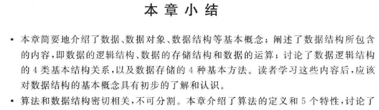
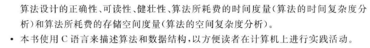
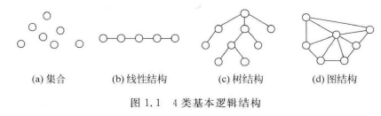
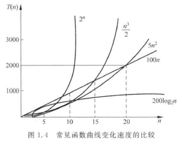
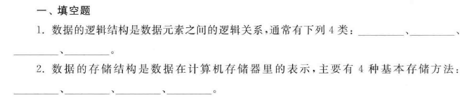
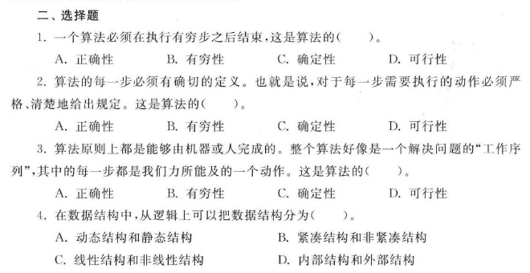
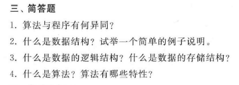
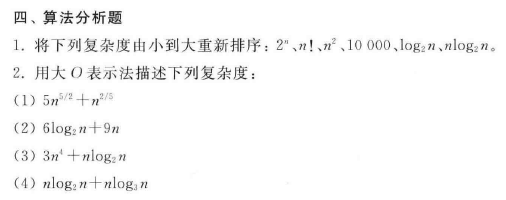
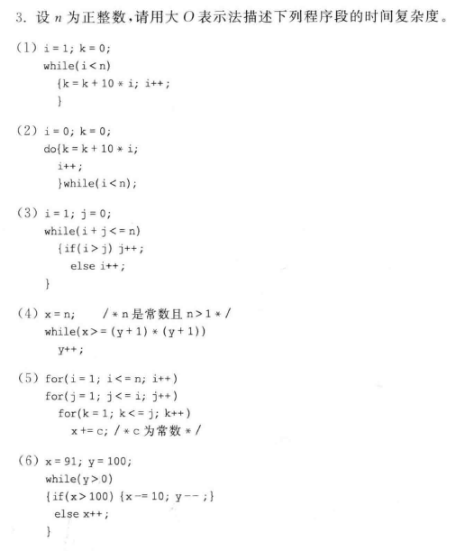

# 概论

## \[学习目标\]

- 1．数据结构基本概念：
    - （1）数据、数据元素、数据类型
    - （2）数据的逻辑结构和存储结构
    - （3）数据的操作
    ​ 基本要求：掌握和理解数据结构相关的基本概念。

- 2．质算法和算法的时间复杂度：
    - （1）算法的概念和性质
    - （2）算法的时间效率分析
    基本要求：掌握和理解算法的概念和性质，掌握和理解算法的时间效率分析，初步能够分析简单算法的时间效率。

## 小结

## 1.1什么是数据结构

**数据**（data）是信息的载体，是对客观事物的符号表示，能够被计算机识别、存储和加工处理。可以说，数据是计算机程序加工的"原料"。

例如：  
一个求解代数方程的程序所处理的对象是整数、实数或复数  
一个编译程序或文本编辑程序所处理的对象是字符串  

**数据元素**（data element）是数据中具有独立意义的个体，是数据的基本单位，通常在计算机程序中作为一个整体进行考虑和处理。数据元素也称为元素、结点或记录。

例如：  
成绩表中的学生成绩信息  
通讯录中的个人或组织的通信信息等   

有时，一个数据元素可以划分为若干个数据项（也称字段、域），数据项是数据不可分割的最小单位。

**数据类型**（data type）是计算机程序中的数据对象以及定义在这个数据对象集合上的一组数据的总称。

例如：  
C语言中的整数类型是区间[-maxint,maxint]上的整数，在这个集合上可以进行加、减、乘、整除、求余等操作。    

数据类型可以分为原子数据类型和结构数据类型。
- 原子数据类型是由计算机语言所提供的  
	如C语言中的整型、实型、字符型
- 结构数据类型是利用计算机语言提供的一种描述数据元素之间逻辑关系的机制，是由用户自己定义而成的  
	如C语言中的数据类型、结构类型等

**数据结构**（data structure）是指数据对象以及该数据对象集合中的数据元素之间的相互关系（数据元素的组织形式）。  

数据元素的研究范围主要包括：
- 研究数据的逻辑结构和物理结构（数据结构在计算机中的表示），并对每种结构定义相适应的运算；
- 使用某种高级程序设计语言给出各种运算的算法并分析算法的效率；
- 研究各种数据结构在计算机科学和软件工程中的某些应用；
- 讨论数据分类、检索等方面的技术。

数据元素的组织形式：
- （1）数据的逻辑结构 - 数据元素之间的逻辑关系
  
  - &#9312;集合：其中的数据元素出了"属于同一个集合"的关系以外，别无其他关系。
  - &#9313;线性结构：其中的数据元素之间存在一对一的关系。
  - &#9314;树结构：其中的数据元素之间存在一对多的关系。
  - &#9315;图结构：其中的数据元素之间存在多对多的关系。

- （2）数据的物理结构 - 数据的元素以及它们之间的相互关系在计算机存储器内的表示（映像），称为数据的存储结构。
  - &#9312;顺序存储方法  
    该方法是将逻辑上响铃的结点存储在物理位置相邻的存储单元中，结点之间的逻辑关系由存储单元的邻接关系来体现。
  - &#9313;链接存储方法  
    该方法不要求逻辑上相邻的结点在物理位置上也相邻，结点之间的逻辑关系是由附加的指针来表示的。
  - &#9314;索引存储方法  
    该方法通常是在存储结点信息的同时，建立附加的**索引表**  
    索引表中的每一项称为**索引项**（关键字，地址）  
    **关键字**(key)是指能够唯一的标识一个结点的那些数据项。
  - &#9315;散列存储方法  
    该方法的基本思想是根据结点的关键字直接计算出该结点的存储地址。
- （3）数据的运算或操作 - 数据元素之间的运算，亦即对数据元素施加的操作

## 1.2为什么要学习数据结构

## 1.3算法和算法分析

**算法**（algorithm）是对特定问题求解步骤的一种描述，它是指令的有限序列，其中每一条指令表示一个或多个操作。  

算法具有的5个特性：

- （1）有穷性
  一个算法必须在执行有穷步之后结束，即算法必须在有限时间内完成
- （2）确定性
  算法中每一步必须有确切的含义，不会产生二义性；  
  并且，在任何条件下，算法只有唯一的一条执行路径，即对于相同的输入只能得出相同的输出
- （3）可行性
  一个算法是可行的，即算法中的每一步都可以通过已经实现的基本运算执行有限次得以实现
- （4）输入
  一个算法有零个或多个输入，他们是算法开始时对算法给出的初始量
- （5）输出
  一个算法有零个或多个输出，它们是与输入有特定关系的量

**算法的时间复杂度分析**  

通常采用大O表示法来描述算法分析的结果。如果存在正的常数$M$和$n_0$，当问题的模式$n \geq n_0$时，算法的时间度量$T(n)\leq Mf(n)$,那么就称该算法的时间复杂度为$O(f(n))$。这种说法意味着：当$n$充分大时，该算法的复杂度不大于$f(n)$的一个常数倍。

$$
c<log_{2}n<n<nlog_{2}n<n^2<n^3<10^n
$$

## 习题1

