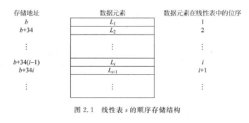
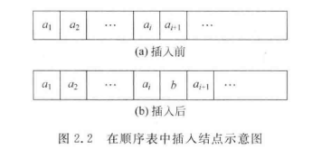
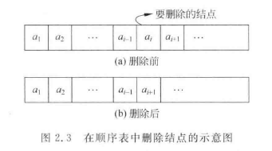

# 线性表

## \[学习目标\]

- 1．线性表的概念

​		基本要求：掌握和理解线性表的定义和特性。

- 2．顺序表:
  - （1）顺序表的存储结构
  - （2）顺序表操作的实现
  - （3）顺序表的效率分析
  - （4）顺序表的应用

基本要求：掌握和理解顺序表的存储结构，会实现顺序表的基本操作，对顺序表的基本操作能够进行时间效率分析，能够用顺序表进行简单的应用设计和实现。

- 3．链表:
  - （1）单链表的存储结构
  - （2）单链表的基本操作
  - （3）单链表的应用
  - （4）循环单链表
  - （5）双向链表
  - （6）静态链表

基本要求：掌握和理解单链表的存储结构，能够实现单链表的基本操作，能够使用单链表实现初步应用，能够分析单链表操作的时间复杂度，掌握和理解循环单链表，双向链表和静态链表的概念和特点，能够实现简单的循环单链表，双向链表和静态链表的基本操作。

## 小结

## 2.1线性表的基本概念

### 2.1.1 线性表的定义

线性表（linear list）是具有相同数据类型的$n(n\geq 0)$个数据元素的有限序列，通常记为
$$(a_1,a_2,…,a_{i-1},a_i,a_{i+1},…a_n)$$
期中数据元素的个数$n$成为线性表的长度。当$n=0$时称为空表

线性表的逻辑特征：（在非空的线性表中）

- 有且只有一个起始节点（第一元素）$a_1$，它没有直接前趋，只有一个直接后继$a_2$
- 有且只有一个终端节点（最后元素）$a_n$，它没有直接后继，只有一个直接前趋$a_{n-1}$
- 除了$a_1$和$a_n$外，其他的每一个节点$a_i$ $(2\le i\le n-1)$都有且只有一个直接前趋$a_{i-1}$和一个直接后继$a_{i+1}$

### 2.1.2 线性表的基本操作

- $InitList(L)$：初始化操作，置$L$为空线性表
- $ClearList(L)$：清除线性表的内容，将$L$置为空表
- $ListLength(L)$：求表长
- $Ins(L, i, Item)$：插入数据。
  - 若$1\le i\le ListLength(L)$，则把$Item$插入到表$L$的第$i$个位置，原来表$L$中从$i$开始的数据一次向后移动，表长加 $1$ ；

  - 若$i<1$或$i>ListLength(L)+1$，则插入不成功

- $Del(L, index)$：删除数据。
  - 若$1\le i\le ListLength(L)$，则删除第$i$个元素，线性表$L$的长度减 $1$；

  - 若$i<1$或$i>ListLength(L)+1$，则删除不成功

- $GetNext(L, val, p)$：获取$Item$所在节点的后继节点。首先找到$Item$所在的位置，然后把$Item$的后继结点的值赋给$p$。
- $GetNode(L, index)$：获取表$L$中位置$i$的结点值。
- $Loc(L, val)$​：获取（按值查找）。
  - 如果表$L$中存在一个值为$Item$的结点，则返回该节点的位置；
  - 如果表$L$中存在多个值为$Item$的的结点，则返回第1次找到的位置；
  - 如果表$L$中不存在值为$Item$的结点，则返回 $0$
- $GetPrior(L, val, p)$：获取$Item$所在节点的前趋结点。首先找到$Item$所谓的位置，然后把$Item$的前趋结点的值赋给$p$。


## 2.2线性表的顺序存储

- （1）顺序表的存储结构
- （2）顺序表操作的实现
- （3）顺序表的效率分析
- （4）顺序表的应用

### 2.2.1顺序表

线性表的顺序存储方式，是指利用一段连续的内存地址来存储线性表的数据元素。在C语言中，是用一个数组来实现的。

#### 顺序存储结构机理

假设线性表$L$的每一个元素需占用$m$个存储单元，并且所占的第$1$个单元的存储地址作为数据元素的存储位置，则有线性表$L$的第$i+1$个数据元素的位置$Loc(a_{i+1})$和第$i$个数据元素的存储位置$Loc(a_i)$之间关系为
$$Loc(a_{i+1})=Loc(a_i)+m$$

即可得，线性表$L$的第$i$个元素的存储位置和第$1$个元素的存储位置之间的关系为
$$Loc(a_i)=Loc(a_i)+(i-1)m$$
$Loc(a+1)$是先行变动而第1个元素$a_1$的存储位置，通常成为线性表的起始位置或基地址

#### 顺序表的特点

<u>以元素在计算机内部存储的物理位置相邻来表示线性表中数据元素之间的逻辑相邻关系。</u>也就是说，如果知道了第$1$个数据元素的地址，就能计算出线性表中任何一个数据元素地址。同样，如果知道了任何一个数据元素的地址，就能算出该数据结构的直接前趋和直接后继的地址。



### 2.2.2 线性表的基本操作

#### 定义顺序表

```C
/*通过宏来控制线性表的容纳数据大小*/
#define maxsize 1024
/*定义int类型别名*/
typedef int DataType;
/*用结构体 定义顺序表*/
typedef struct
{
    DataType elem[maxsize]; //DateType类型的
    int length;	//表长
}SeqList;
```

#### 1.顺序表的初始化

```C
SeqList* InitList(SeqList *L)
{
    /*通过malloc分配顺序表空间*/
    L = (SeqList *)malloc(sizeof(SeqList));
    /*判断顺序表空间是否成功被分配*/
    if(!L)
    {return False;}
    /*将顺序表初始长度设定为0*/
    L->length = 0;
    /*返回顺序表指针*/
    return L;
}
```

#### 2.清除一个线性表的内容

要清除一个已经存在的线性表内容,只需要把该线性表设置为空表,也就是把表长置为0

```C
void ClearList(SeqList *L)
{
    L->length = 0;
    return True;
}
```

#### 3.定位(按值查找)

要查找一个值,只需要从头到尾遍历线性表,如果找到了,则范围找到的位置,否则继续;如果一直到最后一个位置都没找到,则返回$False$

```c
int Loc(SeqList *L, DataType Item)
{
    for(int i=0; i<L->length; i++)
    {
        if(L->elem[i] == Item)
        {
            return i;
        }
    }
    return False;
}
```

#### 4.插入数据

要在线性表中第$i$个位置插入数据$b$,需要考虑以下因素:

- 如果$1 \le i \le L->length$
  则把$Item$插入到第$i$个位置,原来的第$i$个位置及其以后的数据元素向后移动一个位置,然后$L->length ++$, 返回$True$
- 如果$i<1$  or  $i>L->Length$
  则说明插入的位置不合适,返回$False$



```C
int Ins(SeqList *L, int i, DataType b)
{
    /*判断i是否合理*/
    if(i<1 || i>L->length)
    {
        return False;
    }
    else
    {
        for(int j=L->length; j>i; j--)
        {
            L->elem[j] = L->elem[i-1];
        }
        L->elem[i-1] = b;
        L->length++;
        return True;
    }
}
```

#### 5.删除数据

- 如果$1 \le i \le L->length$
  则把原来的第$i$个位置及其以后的数据元素向前移动一个位置,然后$L->length --$, 返回$True$
- 如果$i<1$  or  $i>L->Length$
  则说明删除的位置不合适,返回$False$



```C
int Del(SeqList *L, int i)
{
    /*判断i是否合理*/
    if(i<1 || i>L->length)
    {
     	return False;
    }
    else
    {
        for(int j=i; j<L->length; j++)
        {
            L->elem[j] = L->elem[j+1];
        }
        L->length--;
        return True;
    }
}
```


#### 完整的例子

```C
```


## 2.3线性表的链式存储

### 2.3.1单链表

### 2.3.2循环链表

### 2.3.3双向链表

### 2.3.4双向循环链表

### 2.3.5静态链表

## 2.4线性表顺序存储与链式存储的比较

## 2.5线性表的应用

## 习题2