<!-- 参考借鉴《数据结构（C语言版）（第3版）》 -->

# 线性表

## \[学习目标\]

- 1．线性表的概念

​		基本要求：掌握和理解线性表的定义和特性。

- 2．顺序表:
  - （1）顺序表的存储结构
  - （2）顺序表操作的实现
  - （3）顺序表的效率分析
  - （4）顺序表的应用

基本要求：掌握和理解顺序表的存储结构，会实现顺序表的基本操作，对顺序表的基本操作能够进行时间效率分析，能够用顺序表进行简单的应用设计和实现。

- 3．链表:
  - （1）单链表的存储结构
  - （2）单链表的基本操作
  - （3）单链表的应用
  - （4）循环单链表
  - （5）双向链表
  - （6）静态链表

基本要求：掌握和理解单链表的存储结构，能够实现单链表的基本操作，能够使用单链表实现初步应用，能够分析单链表操作的时间复杂度，掌握和理解循环单链表，双向链表和静态链表的概念和特点，能够实现简单的循环单链表，双向链表和静态链表的基本操作。

## 小结

## 2.1线性表的基本概念

- 1．线性表的概念

​		基本要求：掌握和理解线性表的定义和特性。

### 2.1.1 线性表的定义

线性表（linear list）是具有相同数据类型的$n(n\geq 0)$个数据元素的有限序列，通常记为
$$(a_1,a_2,…,a_{i-1},a_i,a_{i+1},…a_n)$$
期中数据元素的个数$n$成为线性表的长度。当$n=0$时称为空表

线性表的逻辑特征：（在非空的线性表中）

- 有且只有一个起始节点（第一元素）$a_1$，它没有直接前趋，只有一个直接后继$a_2$
- 有且只有一个终端节点（最后元素）$a_n$，它没有直接后继，只有一个直接前趋$a_{n-1}$
- 除了$a_1$和$a_n$外，其他的每一个节点$a_i$ $(2\le i\le n-1)$都有且只有一个直接前趋$a_{i-1}$和一个直接后继$a_{i+1}$

### 2.1.2 线性表的基本操作

- $InitList(L)$：初始化操作，置$L$为空线性表
- $ClearList(L)$：清除线性表的内容，将$L$置为空表
- $ListLength(L)$：求表长
- $Ins(L, i, Item)$：插入数据。
  - 若$1\le i\le ListLength(L)$，则把$Item$插入到表$L$的第$i$个位置，原来表$L$中从$i$开始的数据一次向后移动，表长加 $1$ ；

  - 若$i<1$或$i>ListLength(L)+1$，则插入不成功

- $Del(L, index)$：删除数据。
  - 若$1\le i\le ListLength(L)$，则删除第$i$个元素，线性表$L$的长度减 $1$；

  - 若$i<1$或$i>ListLength(L)+1$，则删除不成功

- $GetNext(L, val, p)$：获取$Item$所在节点的后继节点。首先找到$Item$所在的位置，然后把$Item$的后继结点的值赋给$p$。
- $GetNode(L, index)$：获取表$L$中位置$i$的结点值。
- $Loc(L, val)$​：获取（按值查找）。
  - 如果表$L$中存在一个值为$Item$的结点，则返回该节点的位置；
  - 如果表$L$中存在多个值为$Item$的的结点，则返回第1次找到的位置；
  - 如果表$L$中不存在值为$Item$的结点，则返回 $0$
- $GetPrior(L, val, p)$：获取$Item$所在节点的前趋结点。首先找到$Item$所谓的位置，然后把$Item$的前趋结点的值赋给$p$。

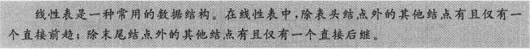

## 2.2线性表的顺序存储

- 2．顺序表:
  - （1）顺序表的存储结构
  - （2）顺序表操作的实现
  - （3）顺序表的效率分析
  - （4）顺序表的应用

基本要求：掌握和理解顺序表的存储结构，会实现顺序表的基本操作，对顺序表的基本操作能够进行时间效率分析，能够用顺序表进行简单的应用设计和实现。

### 2.2.1顺序表

线性表的顺序存储方式，是指利用一段连续的内存地址来存储线性表的数据元素。在C语言中，是用一个数组来实现的。

#### 顺序存储结构机理

假设线性表$L$的每一个元素需占用$m$个存储单元，并且所占的第$1$个单元的存储地址作为数据元素的存储位置，则有线性表$L$的第$i+1$个数据元素的位置$Loc(a_{i+1})$和第$i$个数据元素的存储位置$Loc(a_i)$之间关系为
$$Loc(a_{i+1})=Loc(a_i)+m$$

即可得，线性表$L$的第$i$个元素的存储位置和第$1$个元素的存储位置之间的关系为
$$Loc(a_i)=Loc(a_i)+(i-1)m$$
$Loc(a+1)$是先行变动而第1个元素$a_1$的存储位置，通常成为线性表的起始位置或基地址

#### 顺序表的特点

<u>以元素在计算机内部存储的物理位置相邻来表示线性表中数据元素之间的逻辑相邻关系。</u>也就是说，如果知道了第$1$个数据元素的地址，就能计算出线性表中任何一个数据元素地址。同样，如果知道了任何一个数据元素的地址，就能算出该数据结构的直接前趋和直接后继的地址。


### 2.2.2 线性表的基本操作

#### 顺序表的存储结构定义

```C
/*通过宏来控制线性表的容纳数据大小*/
#define maxsize 1024
/*定义int类型别名*/
typedef int DataType;
/*用结构体 定义顺序表*/
typedef struct
{
    DataType elem[maxsize]; //DateType类型的
    int length;	//表长
}SeqList;
```

#### 1.顺序表的初始化

```C
SeqList* InitList(SeqList *L)
{
    /*通过malloc分配顺序表空间*/
    L = (SeqList *)malloc(sizeof(SeqList));
    /*判断顺序表空间是否成功被分配*/
    if(!L)
    {return False;}
    /*将顺序表初始长度设定为0*/
    L->length = 0;
    /*返回顺序表指针*/
    return L;
}
```

#### 2.清除一个线性表的内容

要清除一个已经存在的线性表内容,只需要把该线性表设置为空表,也就是把表长置为0

```C
void ClearList(SeqList *L)
{
    L->length = 0;
    return True;
}
```

#### 3.定位(按值查找)

要查找一个值,只需要从头到尾遍历线性表,如果找到了,则范围找到的位置,否则继续;如果一直到最后一个位置都没找到,则返回$False$

```c
int Loc(SeqList *L, DataType Item)
{
    for(int i=0; i<L->length; i++)
    {
        if(L->elem[i] == Item)
        {
            return i;
        }
    }
    return False;
}
```

#### 4.插入数据

要在线性表中第$i$个位置插入数据$b$,需要考虑以下因素:

- 如果$1 \le i \le L->length$
  则把$Item$插入到第$i$个位置,原来的第$i$个位置及其以后的数据元素向后移动一个位置,然后$L->length ++$, 返回$True$
- 如果$i<1$  or  $i>L->Length$
  则说明插入的位置不合适,返回$False$


```C
int Ins(SeqList *L, int i, DataType b)
{
    /*判断i是否合理*/
    if(i<1 || i>L->length)
    {
        return False;
    }
    else
    {
        for(int j=L->length; j>i; j--)
        {
            L->elem[j] = L->elem[i-1];
        }
        L->elem[i-1] = b;
        L->length++;
        return True;
    }
}
```

#### 5.删除数据

- 如果$1 \le i \le L->length$
  则把原来的第$i$个位置及其以后的数据元素向前移动一个位置,然后$L->length --$, 返回$True$
- 如果$i<1$  or  $i>L->Length$
  则说明删除的位置不合适,返回$False$


```C
int Del(SeqList *L, int i)
{
    /*判断i是否合理*/
    if(i<1 || i>L->length)
    {
     	return False;
    }
    else
    {
        for(int j=i; j<L->length; j++)
        {
            L->elem[j] = L->elem[j+1];
        }
        L->length--;
        return True;
    }
}
```

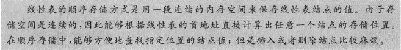

#### 完整的例子

```C

```

## 2.3线性表的链式存储

- 3．链表:
  - （1）单链表的存储结构
  - （2）单链表的基本操作
  - （3）单链表的应用
  - （4）循环单链表
  - （5）双向链表
  - （6）静态链表

基本要求：掌握和理解单链表的存储结构，能够实现单链表的基本操作，能够使用单链表实现初步应用，能够分析单链表操作的时间复杂度，掌握和理解循环单链表，双向链表和静态链表的概念和特点，能够实现简单的循环单链表，双向链表和静态链表的基本操作。

### 2.3.1单链表

以链式结构存储的线性表成为**链表**（linked list）。链式存储结构使用一组任意的存储单元来存储线性表的结点。也就是说，链式存储结构中，存储单元可以是相邻的，也可以是不相邻的；同时，相邻的存储单元中的数据不一定是相邻的结点。
#### 结点的基本构造

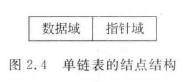
数据域（data）：保存结点中的数据信息的域  
指针域（next）：保存地址信息的域  
链表正是通过每个结点的地址域中的指针，才将线性表的$n$个结点$(1\le i \le n)$按其逻辑顺序$(a_1,a_2,...,a_n)$连接在一起的

#### 单链表的存储结构定义

```C
/*定义int类型别名*/
#define int DataType

/*定义结点*/
typedef struct LNode
{
	ElemType data;			/*数据域*/
	Struct LNode *next		/*指针域*/
}LNode;

/*定义链表*/
typedef LNode LinkList;
/*定义头结点*/
LinkList *head, *L;	
```
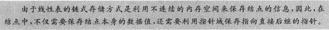

##### 头节点

为了更方便的判断空表、插入和删除结点，可以在单链表的第1个结点前面加上**头结点**。头结点的数据与可以不存储任何信息，也可以存储一些附加信息；头结点的指针域存储链表第1个结点的地址。


#### 1.清除链表的内容

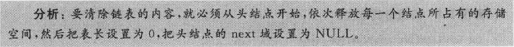

```C
int ClearList(LinkList *L)
{
    LNode *temp;
    temp = (LNode *)malloc(sizeof(LNode));
    while(L->next != NULL)
    {
        temp = L->next;
        L->next = L->next->next;
        free(temp);
    }
    return True;
}
```

#### 2.求表长

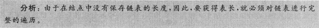

```c
int ListLength(LinkList *L)
{
    int len=0;
    LNode *cur;
    cur = L->next;
    while(cur != NULL)
    {
        len ++;
        cur = cur->next;
	}
    printf("表长为%d\n", len);
    return len;
}
```

#### 3.定位(按值查找)

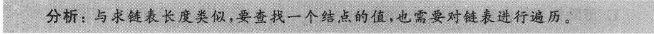

```C
int Loc(LinkList *L, DataType Item)
{
    LNode *cur;
    cur = L->next;
    int count = 1;
    while(cur!=NULL && cur->data!=Item)
    {
        count ++;
        cur = cur->next;
    }
    if(cur]=NULL)
    {
        return count;
    }
    else
    {
        return False;
    }
}
```

#### 4.插入结点

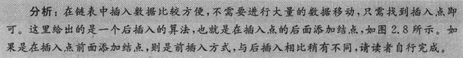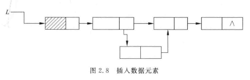

```c
int Ins(LinkList *L, int i, DateType Item)
{
    int count = 1;
    LinkList *node, *temp;
    node = (LNode *)malloc(sizeof(LNode));
    /*判断存储空间分配是否成功*/
    if(!node)
    {return Flase;}
    
    node->data = Item;
   	node->next = NULL;

    temp = L->next;
    /*空表 - 即插入作为第1个结点*/
    if(temp == NULL)
    {
        if(i == 0)
        {
            L->next = node;
            node->next = NULL;
            return True;
        }
        else
        {
            return False;		//没有合适的插入点
        }
    }
    while(count<i && temp!=NULL)
    {
        count++;
        temp = temp->next;
    }
    if(temp == NULL)
    {
        return False;
    }
    node->next = temp->next;
    temp->next = node;
    return Ture;
}
```

*似乎存在一个问题：  
如果$i\le 0$似乎会默认都到第一个数后面（当数组不为空时）*  

#### 5.删除结点

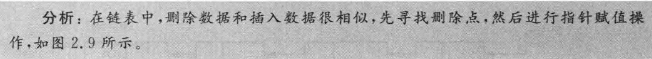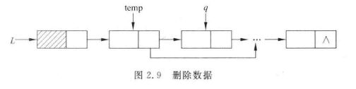
```C
int Del(LinkList *L, int i)
{
    LNode *cur, *pre;
    cur = L->next;
    pre = L;
    int count=1;
    
    while(cur!=NULL && count<i)
    {
        count ++;
        pre = cur;
        cur = cur->next;
    }
    /*判断为空表 或者 删除位置为空*/
    if(cur!=NULL)
    {
        pre->next = pre->next->next;
        return True;
    }
    else
    {
        return False;
    }
}
```

#### 完整的例子

### 2.3.2循环链表

**循环链表**(circular linked list)是一种首尾相接的链表。在单链表中，最后一个结点的指针域为空（NULL），如果把该指针域指向链表的第1个结点（头结点），则能构成一个单链形式的循环链表，简称为**单循环链表**。

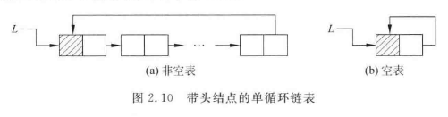

#### 定义循环链表

```C
/*定义int类型别名*/
#define int DataType

/*定义结点*/
typedef struct LNode
{
	ElemType data;			/*数据域*/
	Struct LNode *next		/*指针域*/
}LNode;

/*定义链表*/
typedef LNode CLinkList;
/*定义头结点*/
CLinkList *head, *L;	
```

#### 1.循环链表的建立

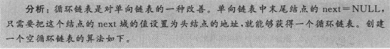

```C
int InitCList(CLinkList *L)
{
    /*创建一个头指针为L的循环链表，若成功，则返回True；否则，返回False*/
    L = (LinkList *)malloc(sizeof(LinkList));
    if(!L)
    {return False;}
    L->next = L;
    return True;
}
```

#### 2.空循环链表的判断
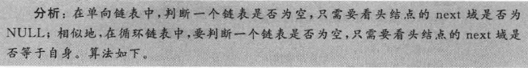

```C
int isempty(CLinkList *L)
{
	if(L->next == L)
	{
		return True;
	}
	else
	{
		return False;
	}
}
```

#### 3.插入结点

```C
int InsCList(LinkList *L, int i, DateType Item)
{
    int count = 1;
    LinkList *node, *temp;
    node = (LNode *)malloc(sizeof(LNode));
    /*判断存储空间分配是否成功*/
    if(!node)
    {return Flase;}
    
    node->data = Item;
   	node->next = L;

    temp = L->next;
    /*空表 - 即插入作为第1个结点*/
    if(temp == L)
    {
        if(i == 0)
        {
            L->next = L;
            node->next = L;
            return True;
        }
        else
        {
            return False;		//没有合适的插入点
        }
    }

    while(count<i && temp!=L)
    {
        count++;
        temp = temp->next;
    }
    if(temp == L)
    {
        return False;
    }
    node->next = temp->next;
    temp->next = node;
    return Ture;
}
```

#### 4.删除结点
```C
int DelCList(LinkList *L, int i)
{
    LNode *cur, *pre;
    cur = L->next;
    pre = L;
    int count=1;
    
    while(cur!=L && count<i)
    {
        count ++;
        pre = cur;
        cur = cur->next;
    }
    /*判断为空表 或者 删除位置为空*/
    if(cur!=L)
    {
        pre->next = pre->next->next;
        return True;
    }
    else
    {
        return False;
    }
}
```

### 2.3.3双向链表

双向链表的结点中有两个指针域，一个指向其直接前趋，另一个指向其直接后继。

#### 双向链表的存储结构定义

```C
#define int DataType

typedef struct DNode
{
    struct DNode *prior;
    DataType data;
    struct DNode *next;
}DNode;

/*定义链表*/
typedef DNode DLinkList;
/*定义头结点*/
DLinkList *L, *head;
```

#### 1.双向链表的建立

```C
int InitDList(DLinkList *DL)
{
    DL = (DNode *)malloc(sizeof(DNode));
    if(!DL)
    {
        return False;
    }
    DL->prior == DL->next = NULL;
    return True;
}
```

#### 2.双向链表为空表的判断

```C
int isempty(DLinkList *DL)
{
    if(DL->prior == DL->next == NULL)
    {
        return True;
    }
    else
    {
        return False;
    }
}
```

#### 3.插入结点

```C
int InsDList(DLinklist *DL, int i, DataType e)
{
    int count = 1;
    DNode *node, *temp;
    node = (DNode *)malloc(sizeof(DNode));
    node->prior = node->next = NULL;
    node->data = e;
    
    temp = (DNode *)malloc(sizeof(DNode));
    temp = DL->next;
    
    if(temp == NULL)
    {
        if(i == 0)
        {
            node->prior = L;
            node->next = NULL;
            
            L->next = node;
            return True;
        }
        else
        {
            return False;		//没有合适的插入点
        }
    }
    while(count<i && temp!=NULL)
    {
        count ++;
        temp = temp->next;
    }
    if(temp!=NULL)
    {
        node->prior = temp;
        node->next = temp->next;
        
        temp->next->prior = node;
        temp->next = node;
        return True;
    }
    else
    {
        return False;
    }
}
```

#### 4.删除结点

```C
int DelDList(DLinkList *DL, int i)
{
    int count = 1;
    DNode *pre, *cur;
    
    pre = L;
    cur = L->next;
    
    while(cur!=NULL && count<i)
    {
        count ++;
        pre = cur;
        cur = cur->next;
    }
    if(cur!=NULL)
    {
        /*判断cur->next是否NULL*/
        if(cur->next != NULL)
        {
            cur->next->prior = pre;
        }
        pre->next = cur->next;
        return True;
    }
    else
    {
        return False;
    }
}
```


### 2.3.4双向循环链表

双向循环链表中，是将头结点的前趋指针指向尾结点，而将尾结点的后继指针指向头结点。  
双向循环链表的操作实质上是把双向链表的循环链表结合起来进行。


### 2.3.5静态链表
由于链表中结点空间的分配和释放都是由系统提供的标准函数$malloc$和$free$动态执行的，因此称之为动态链表(dynamic linked list)。但是有一些程序设计语言本身并不支持"指针"数据类型，所以不能使用动态链表。在这种情况下，就需要引入静态链表的概念。  

<hr />

由于程序设计语言不支持动态分配在地址的方式，因此必须预先分配好存储空间。
- 先定义一个规模较大的数组，作为备用结点空间。当申请结点时，从备用结点空间内取出一个结点
- 当释放结点时，就将结点归还给备用结点空间。  

<hr />

用这种方法实现的单链表，每个结点（结构数组的一个分量）含有两个域：$data$域和$next$域。
- $data$域用来存放结点的数据
- $next$域用来存放模拟指针的"游标"(cursor),它指示了其后继结点在数组中的位置。  
把这种用数组描述的链表称为**静态链表**(static linked list)

```C
#define MAXSIZE 1000		/*链表的最大长度*/
typedef int DataType;
typedef struct SList		/*结点类型*/
{
    DataType data;			/*数据域*/
    int next;				/*游标域*/
}node;
node SlinkList[MAXSIZE];	/*备用结点空间*/
int av;						/*游标变量*/
```


## 2.4线性表顺序存储与链式存储的比较

## 2.5线性表的应用

## 习题2
