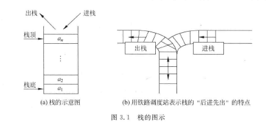
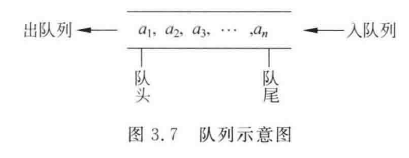

# 栈和队列

## \[学习目标\]

- 1．堆栈
  - （1）堆栈的概念
  - （2）堆栈的顺序和链式实现

基本要求：掌握堆栈的概念和特点，能实现顺序堆栈和链式堆栈的基本操作。

- 2．队列
  - （1）队列的基本概念
  - （2）顺序循环队列
  - （3）链式队列
  - （4）优先级队列

基本要求：掌握队列的概念和特点，掌握顺序循环队列的概念和特点，能够实现队列的基本操作，掌握优先级队列的概念。

- 3．堆栈和队列的应用

基本要求：理解堆栈和队列的经典应用：括号匹配问题，算术表达式计算问题，迷宫问题，调度问题。

## 小结

## 3.1栈

- 1．堆栈
  - （1）堆栈的概念
  - （2）堆栈的顺序和链式实现

基本要求：掌握堆栈的概念和特点，能实现顺序堆栈和链式堆栈的基本操作。

### 3.1.1 栈的定义与基本操作

#### 1.栈的定义
栈(stack)是一种仅允许在一端进行插入和删除运算的线性表。  
**后进先出**  

<hr />

**栈顶**(top)：栈中允许进行插入和删除的一端。栈顶的第一个元素成为栈顶元素。  
**栈底**(bottom)：栈中不可以进行插入和删除的一端（线性表的表头）。  

<hr />

**进栈/入栈/压栈**(push)：在一个栈中插入新元素，即把新元素放刀当前栈顶元素的上面，使其成为新的栈顶元素。  
**出栈/退栈**(pop)：从一个栈中删除一个元素，即把栈顶元素删除掉，使其下面的元素成为新的栈顶元素。  



#### 2.栈的基本操作
- (1) $InitStack(S)$：构造一个空栈$S$。
- (2) $ClearStack(S)$：清除栈$S$中的所有元素。
- (3) $StackEmpty(S)$：判断栈$S$是否为空，若为空，则返回$true$；否则返回$false$。
- (4) $GetTop(S)$：返回$S$的栈顶元素，但不移动栈顶指针。
- (5) $Push(S, x)$：插入元素$x$作为新的栈顶元素（入栈操作）。
- (6) $Pop(S)$：删除$S$的栈顶元素并返回其值（出栈操作）。

### 3.1.2 顺序栈的存储结构和操作的实现
#### 顺序栈存储结构的定义
在C语言中，可以用一维数组描述顺序栈中数据元素的存储区域，并预设一个数组的最大空间。<u>栈底设置在0下标端</u>，<u>栈顶随着插入和删除元素而变化</u>，即入栈的动作使地址向上增长（称为"向上增长"的栈）。
```C
#define Maxsize 100    /*顺序栈的最大长度*/

typedef int DataType;
typedef struct
{
    DataType stack[Maxsize];
    int top;            /*栈顶位置-用于定义栈顶指针*/
}SeqStack;

SeqStack *S;
```

#### 1）构造一个空栈

```C
SeqStack *InitStack(SeqStack *S)
{
    S = (SeqStack *)malloc(sizeof(SeqStack));
    if(!S)
    {
        return False;
    }
    else
    {
        S->top = -1;
        return S;
    }
}
```

#### 2）取栈顶元素

```C
DataType GetTop(SeqStack *S)
{
    if(S->top == -1)
    {
        return False;
    }
    else
    {
        return S->stack[S->top];
    }
}
```

#### 3）入栈

```C
int Push(SeqStack *S, DataType x)
{
    /*判断栈满*/
    if(S->top == Maxsize-1)
    {
        return False;
    }
    else
    {
        S->top++;
        S->stack[S->top]=x;
        return True;
    }
}
```

#### 4）出栈

```C
DataType(SeqStack *S)
{
    /*判断栈空*/
    if(S->top == -1)
    {
        return False;
    }
    else
    {
        S->top--;
        return S->stack[S->top+1];
    }
}
```

#### 5）判别空栈

```C
int StackEmpty(SeqStack *S)
{
    if(S->top == -1)
    {
        return True;
    }
    else
    {
        return False;
    }
}
```

### 3.1.3 链栈的存储结构和操作的实现
#### 链栈存储结构的定义

```C
typedef int DataType;

typedef struct node
{
    DataType data;          /*数据域*/
    struct node *next       /*指针域*/
}SNode;

typedef SNode LinkStack;

LinkStack *S,*top;
```

#### 1）判别空栈

```C
int StackEmpty(LinkStack *top)
{
    if(top==NULL)
    {
        return False;
    }
    else
    {
        return True;
    }
}
```

#### 2）取栈顶元素

```C
DataType GetTop(LinkStack *top)
{
    /*判断栈空*/
    if(top == NULL)
    {
        return False;
    }
    else
    {
        retrun top->data;
        retrun True;
    }
}
```

#### 3）入栈

```C
LinkStack * Push(LinkStack *top, DataType x)
{
    SNode *p;
    p=(SNode *)malloc(sizeof(SNode))
    p->data = x;
    p->next = top;
    top = p;
    retrun top;
}
```

#### 4）出栈

```C
LinkStack * Pop(LinkStack *top)
{
    SNode *q;
    q = (SNode *)malloc(sizeof(SNode));
    q = top;
    top = top->next;
    free(q);
    return top;
}
```

## 3.2栈的应用

## 3.3队列

- 2．队列
  - （1）队列的基本概念
  - （2）顺序循环队列
  - （3）链式队列
  - （4）优先级队列

基本要求：掌握队列的概念和特点，掌握顺序循环队列的概念和特点，能够实现队列的基本操作，掌握优先级队列的概念。
### 3.3.1 队列的定义与基本操作
#### 1.队列的定义
队列(queue)也是线性表的一种特例，它是一种限定在表的一端进行插入而在另一端进行删除的线性表。  
**先进先出**

<hr />

**队头**(front)：允许删除的一端。  
**队尾**(rear)：允许插入的一端。

<hr />

**入队/进队**：向队列中插入新元素。新元素入队后，就成为了新的队尾元素。  
**出队/退队**：从队列中删除元素。元素离队后，其后继元素就成为了新的队头元素。



#### 2.队列的基本操作
- (1) $InitQueue(Q)$：构造一个空队列$Q$。
- (2) $QueueEmpty(Q)$：判断队列是否为空。
- (3) $QueueLength(Q)$：求队列的长度。
- (4) $GetHead(Q)$：返回$Q$的队头元素，不改变队列状态。
- (5) $EnQueue(Q, x)$：插入元素$x$作为$Q$的新的队尾元素。
- (6) $DeQueue(Q)$：删除$Q$的队头元素。
- (7) $ClearQueue(Q)$：清除队列$Q$中的所有元素

### 3.3.2 链队列的存储结构和操作的实现
#### 链队列存储结构的定义

链队列就使用链表表示的队列，它是限制仅在表头进行删除和在表尾进行插入的单链表。一个链队列需要两个分别指示队头（头指针）和队尾（尾指针）的指针。  
要区分好头指针和头结点是有区别的

```C
typedef int DataType;
typedef struct QNode
{
    DataType data;          /*数据域*/
    Struct QNode *next;     /*指针域*/
}QNode;

typedef struct
{
    QNode *front;
    QNode *rear;
}LinkQueue;

LinkQueue *Q;
```

#### 1）构造空队列

```C
LinkQueue *InitQueue(LinkQueue *Q)
{
    /*定义一个别的位置的头结点，因为是链表，所以地址上不需要有顺序上的连贯*/
    
    QNode *p;
    Q = (LinkQueue *)malloc(sizeof(LinkQueue)); /*为队列头指针分配空间*/
    p = (QNode *)malloc(sizeof(QNode));         /*为头结点分配空间*/
    p->next = NUll;                             /*置头结点的指针域为空*/
    Q->front = Q->rear = p;                     /*队首指针、队尾指针均指向头结点*/
    return Q;
}
```

#### 2）取队头元素

```C
DataType GetHead(LinkQueue *Q)
{
    /*判断队列为空*/
    if(Q->front == Q->rear)
    {
        retrun False;
    }
    retrun Q->front->next->data;
}
```

#### 3）入队

```C
int EnQueue(LinkQueue *Q, DataType x)
{
    QNode *temp;
    temp = (QNode *)malloc(sizeof(QNode));
    temp->data = x; temp->next = NULL;
    Q->rear->next = temp;
    Q->rear = temp;
}
```

#### 4）出队

```C
DataType DeQueue(LinkQueue *Q)
{
    QNode *temp;
    DataType x;
    temp = (QNode *)malloc(sizeof(QNode));
    /*判断队列为空*/
    if(Q->front == Q->rear)
    {
        return False;
    }
    else
    {
        temp = Q->front->next
        x = temp->data;
        Q->front->next = temp->next;
        /*判断是否删除之后列表为空，则需要重新定义尾指针位置*/
        //课本上写的是if(Q->rear==temp)，实际上表达意思相同，要表达的意思都是free(temp)之后Q->rear的指针会消失，影响下一轮的操作
        if(Q->front->next == Q->rear)
        {
            Q->rear = Q->front;     /*修改对尾指针指向头节点*/
        }
        free(temp);                 /*释放空间*/
        return x;                   /*返回出队元素的值*/
    }
}
```

### 3.3.3 顺序队列的存储结构和操作的实现

#### 顺序队列存储结构的定义

```C
#define Maxsize 100

typedef int DataType;

typedef struct
{
    DataType data[Maxsize];
    int front;
    int rear;
}SeqQueue;
```

#### 1）构造空队列

#### 2）判断队空

#### 3）入队

#### 4）出队

## 3.4队列的应用

## 3.5递归

## 习题3
