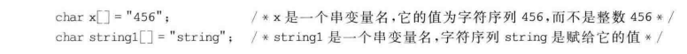

# 串

## \[学习目标\]

- **1．串的概念和存储结构**
- （1）串的概念
  
- （2）串的存储结构和基本算法的实现

基本要求：掌握串的概念，串的存储结构（静态存储结构和动态存储结构），能够实现串的基本操作。

- **2．串的匹配算法**
  - （1）BF算法
  - （2）KMP算法
  - （3）链式队列
  - （4）优先级队列

基本要求：掌握和理解串的匹配算法：BF算法和KMP算法。

## 小结

## 4.1串的定义

### 4.1.1串的定义
**串**(string)是字符串的简称，是由零个或多个字符组成的有限序列。一般记为  
$$S="a_1a_2...a_n"$$
其中：

- （1）$S$是串名
- （2）用双引号（“”）括起的字符序列是串的值。它的作用是避免串与常数或与标识符混淆。
- （3）$a(i\le i\le n)$可以是字母、数字或其他字符。
- （4）串字符的数目$n$称为该串的**长度**。长度为零($n=0$)的串称为**空串**(null string)，它不包含任何字符

<hr />

**子串 & 主串**


<hr />

**串的比较**


<hr />

**串变量 & 串常量**



### 4.1.2 串的基本操作

- （1）$Strlen(S)$求串长：求串$s$的长度。
- （2）$StringAssign(s,string_constant)$串赋值：给串$s$赋值。
- （3）$Strcpy(s,t)$串复制：将串$s$复制得到串$t$。
- （4）$Strcat(s,t)$串连接：将串$t$连接到串$s$的末尾形成新串$s$。
- （5）$Strcmp(s,t)$串比较：比较$s$和$t$的大小，若$s<t$则返回值为$-1$；若$s>t$，则返回值为$1$;若$s=t$，则返回值为0。
- （6）$Substr(s,pos,len,sub)$求子串：从串$s$中的第$pos$个字符开始取长度为$len$的子串构成$sub$。
- （7）$Index(s,t)$子串的定位：在串$s$中寻找串$t$第一次出现时，串$t$首字符在串$s$中的位置。若找到，则返回该位置；否则返回$0$。
- （8）$StrInsert(s,pos,t)$串插入：将串$t$插入串$s$的位置$pos$上。
- （9）$StrDelete(s,pos,len)$串删除：从串$s$中的位置$pos$开始，删除$len$个字符。
- （10）$Replace(s,t,v)$子串替换：将串$s$中的子串$t$全部调换成串$v$。
## 4.2串的表示和实现

### 4.2.1 串的定长顺序存储
#### 串的定长顺序存储结构表示
串的顺序存储结构，简称为顺序串。

```C
#define MaxStrSize 256				/*定义串可能的最大长度*/
typedef char SeqString[MaxStrSize];	/*SeqString是顺序串类型*/
SeqString s;						/*S是一个顺序串变量*/
```


#### （1）求串长Strlen(s)
返回串s的元素个数

```C
int Strlen(SeqString s)
{
 	return s.length
}
```

#### （2）串复制Strcpy(s,t)
将串s复制到串t中

```C
SeqString *Strcpy(SeqString s,SeqString *t)
{
    int i;
    for(i=0; i<s.length; i++)
    {
        t->ch[i]=s.ch[i];
    }
    t->length = s.length;
    return t;
}
```

#### （3）串连接Strcat(s,t)
将串t连接到串s的末尾形成新串s。若t完全连接到s的末尾，表示连接成功，返回True；否则不成功，返回False

```C
int Strcat(SeqString s, SeqString t)
{
	/*判断串s和串t的长度之和是否超过串的最大长度*/
	if(s.length+t.length<=MaxStrSize)
	{
		for(int i=0;i<t.length;t++)
		{
			s.ch[i+s.length]=t.ch[i];
		}
		s.length=s.length+t.length;
		return True;
	} 
	else
	{
		for(int i=0; i<MaxStrSize-s.length;i++)
		{
			s.ch[i+s.length]=t.ch[i];
		}
		s.length=MaxStrSize;
		return False;
	}
}
```
#### （4）求子串Substr(s,pos,len,sub)
从串s中的第pos个字符开始取长度为len的子串sub，并返回串sub
```C
SeqString *Substr(SeqString s, int pos, int len, SeqString *sub)
{
	/*判断pos和len的合法性*/
	if(pos<1||pos>=s.length||len<0||len>s.length-pos+1)
	{
		return False;
	}
	for(int i=0 ;i<=len;i++)	//这里加上'='是因为要取'/0'停止符
	{
		sub->ch[i]=s.ch[pos+i-1];
	}
	sub->length = len;
	return sub;
}
```

#### （5）串删除StrDelete(s,pos,len)
从串s中的位置pos开始，删除len个字符，并返回串s。
```C
SeqString *StrDelete(SeqString *s, int pos, int len)
{
	/*判断pos和len的合法性*/
	if(pos<=0||len>=s->length-pos+1)
	{
		return False;
	}
	for(int i=pos+len-1; i<s->length; i++)
	{
		s->ch[i-len]=s->ch[i];
	}
	s->length = s->length-len;
	return s;
}
```

### 4.2.2 串的堆存储结构


#### 串的堆存储结构表示

堆存储结构的特点是，仍以一组空间足够大的、地址连续的存储单元存放串值字符串序列，但该存储空间的大小不是预定义的，而是在程序执行过程中动态分配的。每当产生一个新串时，系统就从剩余空间的起始处为串值分配一个长度和串值长度相等的存储空间。采用这种方法可以灵活地申请适当数目的存储空间，从而提高存储资源的利用率。

```C
typedef struct
{
    char *ch;				/*ch指向串起始地址*/
    int length;				/*串的实际长度*/
}Hstring;
```

#### （1）串连接Strcat(s,t)

将串t连接到串s的末尾形成新串s。若t完全连接到s的末尾，表示连接成功，返回True；否则不成功，返回False

```C
Hstring *Strcat(Hstring s, Hstring t)
{
	Hstring *new;
	if(!new=(Hstring *)malloc(sizeof(Hstring)))
	{return False;}
	if(!new->ch=(char *)malloc(s.length+t.length))
	{return False;}
	
	for(int i=0; i<s.length; i++)
	{
		new->ch[i]=s.ch[i];
	}
	
	for(int i=0; i<t.length; i++)
	{
		new->ch[s.length+i]=t.ch[i];
	}
	
	new->length=s.length+t.length;
	return new;
}
```

#### （2）串插入StrInsert(s,pos,t)
将串t插入串s的位置pos上，并返回串s。

```C
Hstring *StrInsert(Hstring *s, int pos, Hstring *t)
{
	char *p;
	/*判断pos的合法性*/
	if(pos<=0||pos>s->length)
	{
		return False;
	}
	if(t->length)
	{
		/*串t非空，重新分配空间，插入串t*/
		if(!p=(char *)realloc(s->ch,(s->length+t->length)*sizeof(char)))
		{return 0;}
		s->ch = p;
		for(i=s->length-1; i>=pos-1; i--)
		{
			s->ch[i+t->length]=s->ch[i];
		}
		for(i=0; i<t->length; i++)
		{
			s->ch[pos+i-1]=t->ch[i];
		}
		s->length = s->length + t->length;
	}
	return s;
}
```

#### （3）串删除StrDelete(s,pos,len)
从串s中的位置pos开始，删除len个字符

```C
int StrDelete(Hstring *s, int pos, int len)
{
	char *p;
	/*判断pos和len的合法性*/
	if(pos<=0 || s->length-pos<len)
	{return False;}
	p = s->ch + pos -1;
	for(int i=0;i<len;i++)
	{
		*(p+i) = *(p+len+i);
	}
	s->lenth = s->length-n;
	return True;
}
```

### 4.2.3 串的块链存储结构
串可以用链式存储方式表示，串的链式存储结构简称**链串**。
```C
typedef struct
{
	char ch;
	struct cnode *next;
}cnode, *LinkString;

LinkString head;
```

<hr />


```C
#define CHUNKSIZE = 4		/*定义块大小*/
typedef struct Chunk		/*定义块链节点结构*/
{
    char str[CHUNKSIZE];
    struct Chunk *next;
}Chunk;

typedef struct				/*定义块链存储结构*/
{
    Chunk *head,*tail;		/*链表头指针和尾指针*/
    int strlen;				/*串的实际长度*/
}Lstring;
```


## 4.3串的模式匹配算法

### 4.3.1 基本的模式匹配算法

### 4.3.2 模式匹配的改进算法——KMP算法

## 习题4