# 多维数组和广义表

## \[学习目标\]

- **1．数组的概念**
  - （1）数组概念
  - （2）数组的实现

基本要求：掌握数组的概念和数组的内存分配和实现。

- **2．特殊矩阵和稀疏矩阵的压缩存储**
  - （1）特殊矩阵的压缩存储
  - （2）稀疏矩阵的压缩存储。

基本要求：掌握和理解特殊矩阵（比如对称矩阵，三角矩阵等）的压缩方法，掌握和理解稀疏矩阵的压缩存储方法。

<hr />

- **2．广义表**
  - （1）广义表的概念
  - （2）广义表的存储结构和操作实现。

基本要求：掌握和理解广义表概念，掌握和理解广义表的存储结构和基本操作算法的实现。

## 小结

## 5.1多维数组

- **1．数组的概念**
  - （1）数组概念
  - （2）数组的实现

基本要求：掌握数组的概念和数组的内存分配和实现。

- **2．特殊矩阵和稀疏矩阵的压缩存储**
  - （1）特殊矩阵的压缩存储
  - （2）稀疏矩阵的压缩存储。

基本要求：掌握和理解特殊矩阵（比如对称矩阵，三角矩阵等）的压缩方法，掌握和理解稀疏矩阵的压缩存储方法。

### 5.1.1多维数组的定义

#### 数组的定义

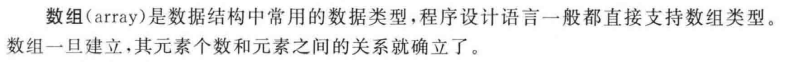

#### 一维数组的定义

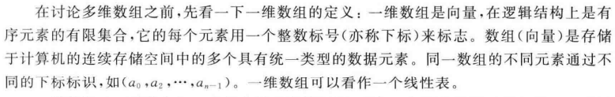

*所以很多人直接称呼顺序表为数组*

#### 二维数组的定义

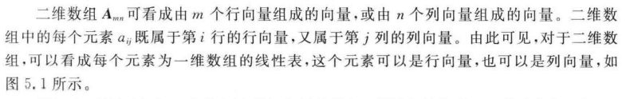

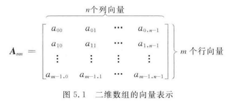

#### 多维数组的定义

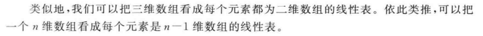

#### 数组的基本运算

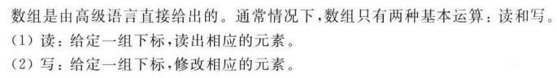

### 5.1.2 数组的存储结构

#### 数组的类型 & 地址  

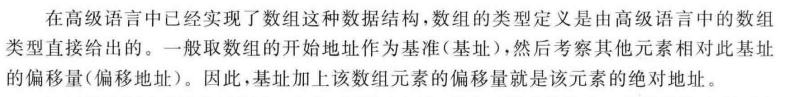

<hr />

#### 数组中数据元素的地址 

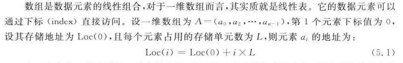

<hr />

#### 在内存中存储多维数组  
内存是一段连续的以为存储空间，不是多维的存储空间  
要存储多维数组，需要<u>转化成一维数组</u>来表示    

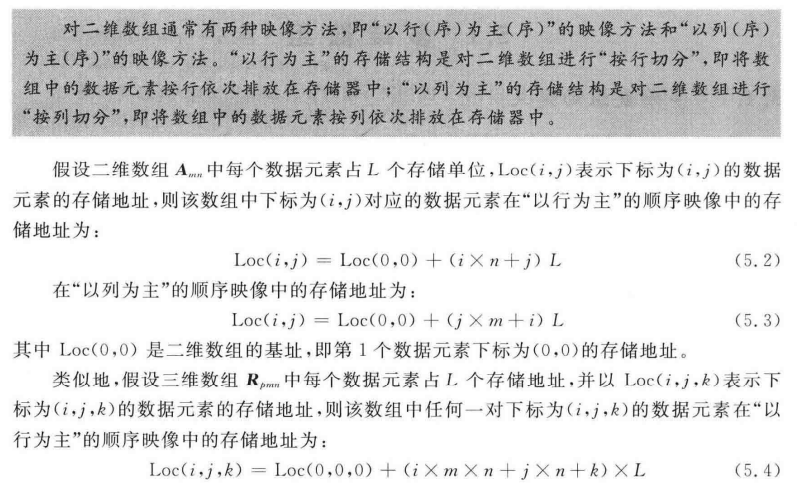

<hr />

**举例**

$$\begin{bmatrix}
  &1  &2  &3	\\
  &4  &5  &6	\\
  &7  &8  &9 
\end{bmatrix}$$  

$n=3,m=3$  

$i=0,j=0：Loc(0,0) = Loc(0,0)+(0*3+0)=1$  

$i=0,j=1：Loc(0,1) = Loc(0,0)+(0*3+1)=2$  

$i=0,j=2：Loc(0,2) = Loc(0,0)+(0*3+2)=3$  

$i=1,j=0：Loc(1,0) = Loc(0,0)+(1*3+0)=4$  

$i=0,j=0：Loc(1,1) = Loc(0,0)+(1*3+1)=5$  

$i=0,j=0：Loc(1,2) = Loc(0,0)+(1*3+2)=6$  

$i=0,j=0：Loc(2,0) = Loc(0,0)+(2*3+0)=7$  

$i=0,j=0：Loc(2,1) = Loc(0,0)+(2*3+1)=8$  

$i=0,j=0：Loc(2,2) = Loc(0,0)+(2*3+2)=9$  

<div style="text-align:center;">
<span style="border:1px solid grey; width:100px; height:30px; display:inline-block;">Num [<small>Addr</small>]</span><br />
<span style="border:1px solid grey; width:100px; height:30px; display:inline-block;">1 [<small>Loc(0,0)+0</small>]</span>
<span style="border:1px solid grey; width:100px; height:30px; display:inline-block;">2 [<small>Loc(0,0)+1</small>]</span>
<span style="border:1px solid grey; width:100px; height:30px; display:inline-block;">3 [<small>Loc(0,0)+2</small>]</span><br />
<span style="border:1px solid grey; width:100px; height:30px; display:inline-block;">4 [<small>Loc(0,0)+3</small>]</span>
<span style="border:1px solid grey; width:100px; height:30px; display:inline-block;">5 [<small>Loc(0,0)+4</small>]</span>
<span style="border:1px solid grey; width:100px; height:30px; display:inline-block;">6 [<small>Loc(0,0)+5</small>]</span><br />
<span style="border:1px solid grey; width:100px; height:30px; display:inline-block;">7 [<small>Loc(0,0)+6</small>]</span>
<span style="border:1px solid grey; width:100px; height:30px; display:inline-block;">8 [<small>Loc(0,0)+7</small>]</span>
<span style="border:1px solid grey; width:100px; height:30px; display:inline-block;">9 [<small>Loc(0,0)+8</small>]</span><br />
     均在一行，位置不够且方便理解才分行
</div>


## 5.2 压缩存储

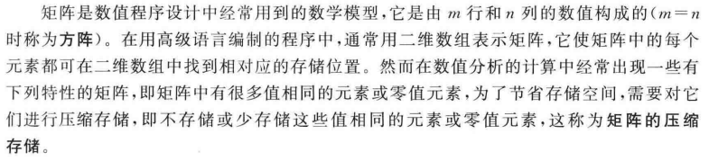

### 5.2.1 特殊矩阵

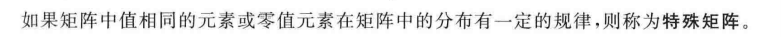

#### 1.对称矩阵

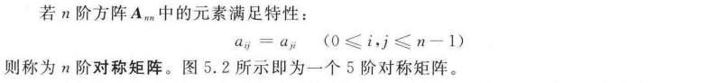<br /> 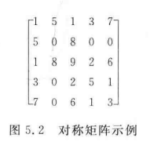

##### 对称矩阵的压缩存储

**基本思想**

对称矩阵中的元素关于主对角线对称，因此只要存储矩阵的上三角或下三角中的元素，就可以节省近一般的存储空间。  

$$\begin{bmatrix}
  &1  &  &  &  & \\
  &5  &0  &  &  & \\
  &1  &8  &9  &  & \\
  &3  &0  &2  &5  & \\
  &7  &0  &6  &1  &3 
\end{bmatrix}$$  

下三角矩阵：$a_{ij} = S_{a}[i(i+1)/2+j]$

$$\begin{bmatrix}
  &1  &5  &1  &3  &7 \\
  &  &0  &8  &0  &0 \\
  &  &  &9  &2  &6 \\
  &  &  &  &5  &1 \\
  &  &  &  &  &3 
\end{bmatrix}$$  

上三角矩阵：$a_{ij} = S_{a}[j(j+1)/2+i]$


**统一关系**  

$I=max(i,j),J=min(i,j)$   
$k = I(i+1)/2+J$	$0\le k<n(n+1)/2$

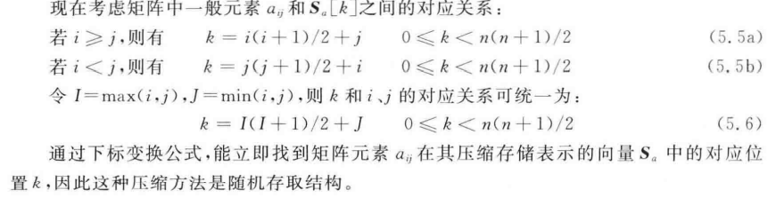

#### 2.三角矩阵

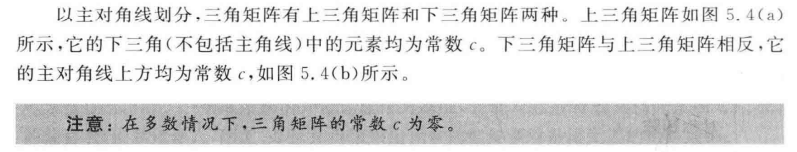

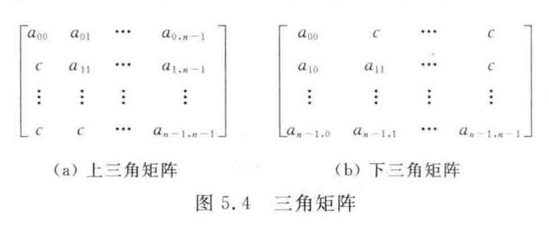

##### 三角矩阵的压缩存储

**基本思想**

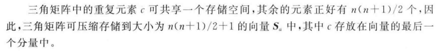

上三角矩阵

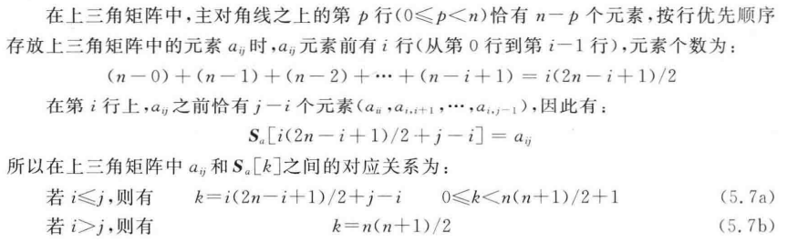

下三角矩阵

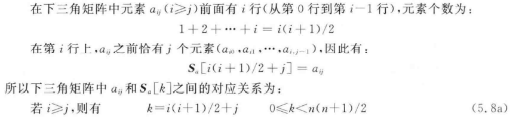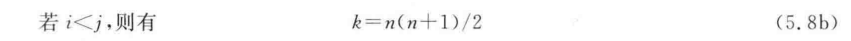

#### 3.对角矩阵

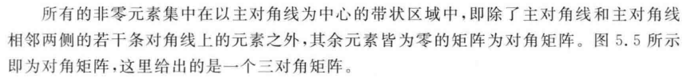

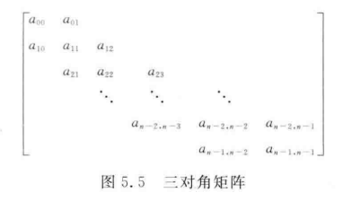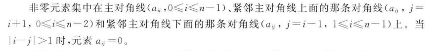

##### 对角矩阵的压缩存储

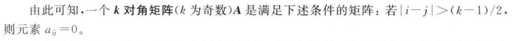

<hr />


### 5.2.2 稀疏矩阵

**2．特殊矩阵和稀疏矩阵的压缩存储**

- （1）特殊矩阵的压缩存储
- （2）稀疏矩阵的压缩存储。

#### 稀疏矩阵的定义

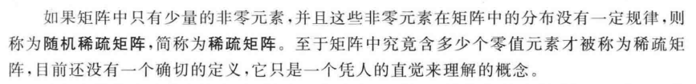

#### 稀疏矩阵压缩存储

压缩存储的目标：

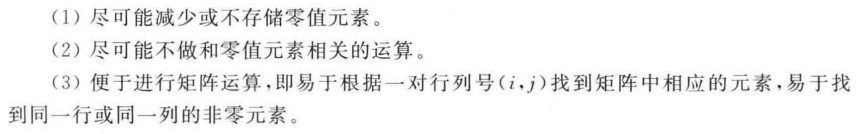

##### 1 三元组表

**三元组表的实现**

将稀疏矩阵非零元素的三元组（i,j,val）按行/列的顺序排列，则得到一个结点均是三元组的线性表。该线性表的顺序存储结构称为系数矩阵的三元组表。

```C
#define MaxSize 10000		/*非零元素个数的上限，三元组表的容量*/
typedef struct {
	int i,j;				/*非零元素的行号、列号*/
	DataType v;				/*非零元素的值*/
}TriTupleNode;				/*三元组结点的类型*/

typedef struct {
	TriTupleNode data[MaxSize];		/*三元组表*/
	int m,n;						/*矩阵的行数、列数*/
	int t;							/*当前表长，即非零元素的个数*/
}TriTUpleTable;						/*稀疏矩阵类型*/

```

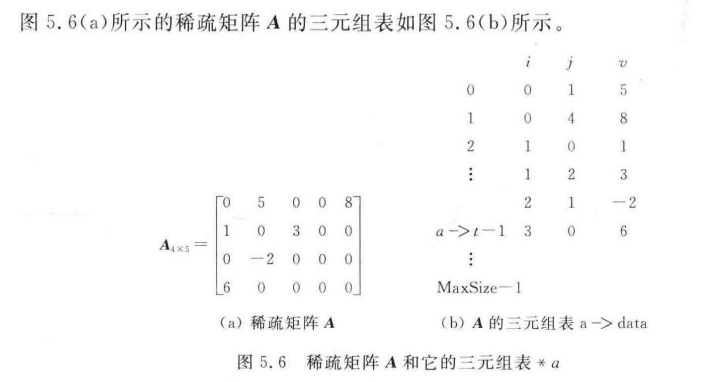

<hr />

**三元组表的基本运算**

- GET(i,j)
- SET(i,j,x)

##### 2 十字链表

#### 稀疏矩阵的转置

##### 用三元组表表示的系数矩阵转置

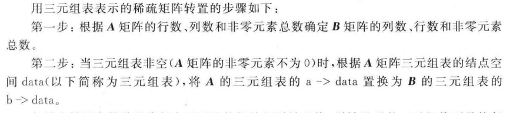

- 1）按列序转置，顺序存放
- 2）按行序转置，按列索引存放

## 5.3广义表

- **2．广义表**
  - （1）广义表的概念
  - （2）广义表的存储结构和操作实现。

基本要求：掌握和理解广义表概念，掌握和理解广义表的存储结构和基本操作算法的实现。

<hr />

### 广义表的概念

**广义表**也称为**列表**，它是线性表的推广。

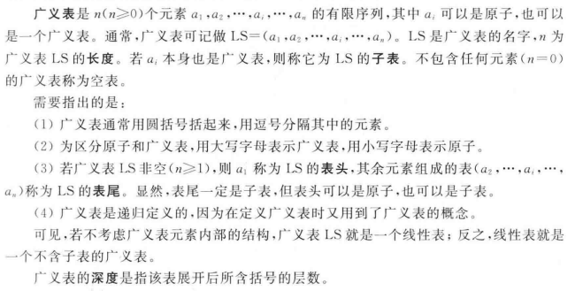

*（原子：结构上不可再分割的一种成分，它可以是一个数，也可以是一个结构）*

**举例**

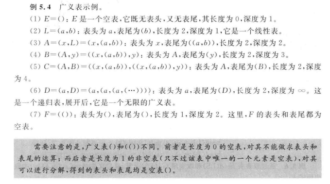

<hr />

- **纯表**：与树对应的广义表
  没有共享和递归的成分，即没有任何成分出现多次
  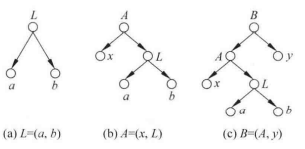
- **再入表**：与有向无环图对应的广义表
  存在元素共享，在图中表现为存在结点共享
  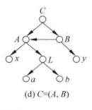
- **递归表**：有回路的有向图对应的广义表
  某个成员内含有广义表自己
  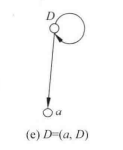

各种表之间的关系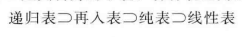

### 广义表的基本运算
- $head(LS)$	取表头
- $tail(LS)$	取表尾

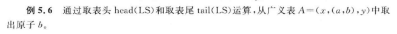

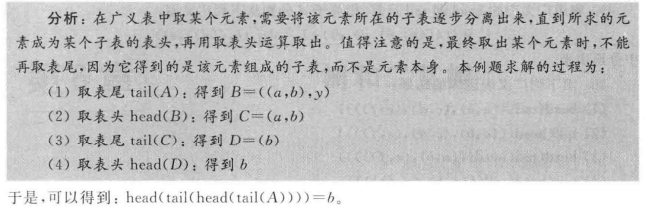


## 习题5