# 树和二叉树

## \[学习目标\]

- **1．树的概念**
  - （1）树的概念
  - （2）树的存储结构

基本要求：掌握和理解有关树的概念，掌握和理解树的常用存储结构。

- **2．二叉树**
  - （1）二叉树的概念和性质
  - （2）二叉树的存储结构和基本算法实现。

基本要求：掌握和理解二叉树的概念和基本性质，掌握和理解二叉树的存储结构（特别是链式存储结构），能够实现二叉树的基本算法。

- **3．二叉树的遍历算法**
  - （1）深度递归和广度递归算法
  - （2）遍历算法的应用

基本要求：掌握理解二叉树深度遍历（前序，中序和后序）的递归和非递归算法，能够用二叉树遍历思想解决一些树的问题。

- **4．线索二叉树**

基本要求：掌握和理解线索二叉树的概念。

- **5．哈夫曼树**
  - （1）哈夫曼树的概念
  - （2）哈夫曼编码问题。

基本要求：掌握和理解哈夫曼树的概念，掌握和理解哈夫曼编码问题的实现。

- **6．树与二叉树的转换**
  - （1）树的遍历
  - （2）树和二叉树的转换

基本要求：掌握和理解树的遍历方法，能够进行树和二叉树的转换。

## 小结

- **1．树的概念**
  - （1）树的概念
  - （2）树的存储结构

基本要求：掌握和理解有关树的概念，掌握和理解树的常用存储结构。

## 6.1树的概念与基本操作

### 6.1.1 树的定义

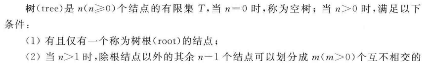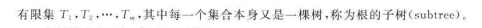

**特点**

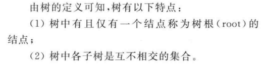

### 6.1.2 树的一些基本概念

- **结点**(node)
  表示树中的元素，包括数据项及若干指向其子树的分支
- **结点的度**(degree)
  结点拥有的子树的数目
  - **叶子**(leaf)**结点**
    度为0的结点称为叶子结点，也称为终端节点
  - **分支结点**
    度不为0的结点称为分支节点，也称为非终端节点
- **孩子结点**(child)
  结点的子树的根称为该结点的孩子结点
- **双亲结点**(parents)
  孩子结点的上层结点称为该结点的双亲结点
- **兄弟节点**(sibling)
  具有同一双亲结点的孩子结点之间互称为兄弟节点
- **树的度**
  树中最大的结点的度即为树的度
- **结点的层次**(level)
  从根节点算起，根为第1层，它的孩子为第二层，以此类推。若某节点在第i层，则其孩子结点在i+1层。
- **树的高**度(depth)
  树中结点的最大层次树。
- **森林**(forest)
  m棵互不相交的树的集合。
- **有序树和无序树**
  若树中结点从左至右是有次序的（不能互换），则称该树为**有序树**，否则称该树为**无序树**。

### 6.1.3 树的基本操作

- （1）$Init Tree(T)$初始化操作，置$T$为空树
- （2）$Root(T)$求$T$的树根。若$T$是空树，则函数返回值为$False$
- （3）$Create_Tree(T)$创建一棵树
- （4）$Parent(T,x)$求结点$x$的双亲结点。若结点$x$是树$T$的根结点，则函数返回值为$NULL$
- （5）$Child(T,x,i)$求树$T$中结点$x$的第$i$个孩子结点。若结点$x$是树$T$的叶子结点或无第$i$个孩子，则函数返回值为$False$
- （6）$InsertChild(Y,i,X)$插入子树。使以结点$X$为根的树为结点$Y$的第$i$棵子树。若原树中无结点$Y$或结点$Y$的子树的个数$<i-1$，则函数返回值为$False$
- （7）$DeleteChild(x,i)$删除子树。删除结点$x$的第$i$棵子树。若无结点$x$或结点$x$的子树个数$<i$，则函数返回值为$False$
- （8）$TraverseTree(T)$树的遍历。按某种次序依次访问树中的每个结点，并使每个结点仅被访问一次
- （9）$Clear(T)$清除树结构。将树$T$置为空树
- （10）$EmptyTree(T)$判断树$T$是否为空。若为空则返回$True$，否则返回$False$

## 6.2二叉树

- **2．二叉树**
  - （1）二叉树的概念和性质
  - （2）二叉树的存储结构和基本算法实现。

基本要求：掌握和理解二叉树的概念和基本性质，掌握和理解二叉树的存储结构（特别是链式存储结构），能够实现二叉树的基本算法。

- 

### 6.2.1 二叉树的定义和基本操作

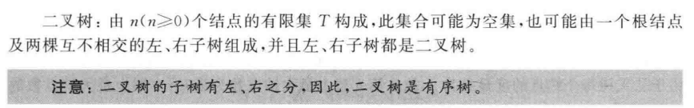

#### 二叉树的特点  

#### 二叉树的基本操作

- （1）$InitBtree(BT)$初始化操作，置$BT$为空二叉树
- （2）$Root(BT)$求$BT$的树根。若$BT$是空树，则返回$False$
- （3）$Create_BTree(BT)$创建一棵二叉树
- （4）$Parent(BT,x)$求结点$x$的双亲结点。若结点$x$是二叉树$BT$的根节点，则返回$False$
- （5）$Lchild(BT,x)$求二叉树$BT$中结点x的左孩子结点。若结点$x$是二叉树BT的叶子节点，则返回$False$
- （6）$Rchild(BT,x)$求二叉树$BT$中结点$x$的右孩子结点。若结点x是二叉树$BT$的叶子节点，则返回$False$
- （7）$TraverseBtree(BT)$二叉树的遍历。按某种次序依次访问二叉树中的每个结点，并使每个结点仅被访问一次
- （8）$Clear(BT)$清除二叉树结构。将树$BT$置为空树
- （9）$EmptyTree(BT)$判断二叉树$BT$是否为空。若为空则返回$True$，否则返回$False$

### 6.2.2 二叉树的性质

#### 性质1

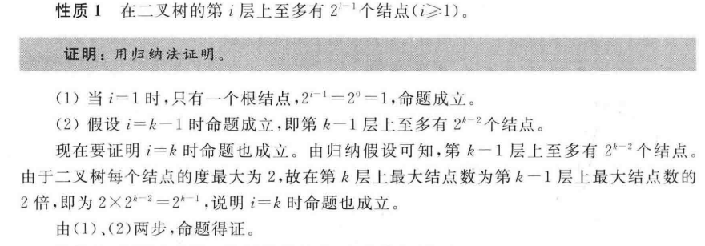

#### 性质2

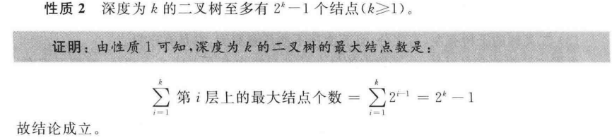

#### 性质3

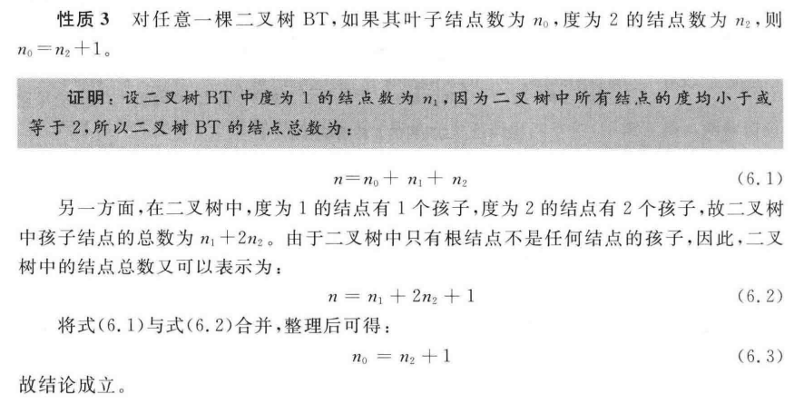

#### 扩展 

##### 满二叉树

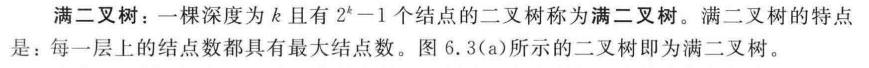

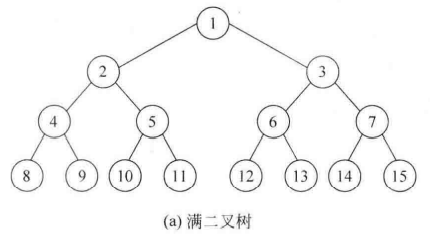

##### 完全二叉树

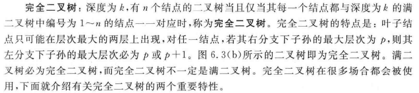

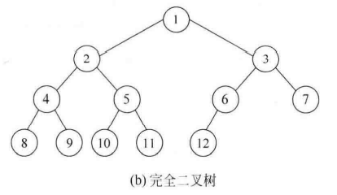

#### 性质4

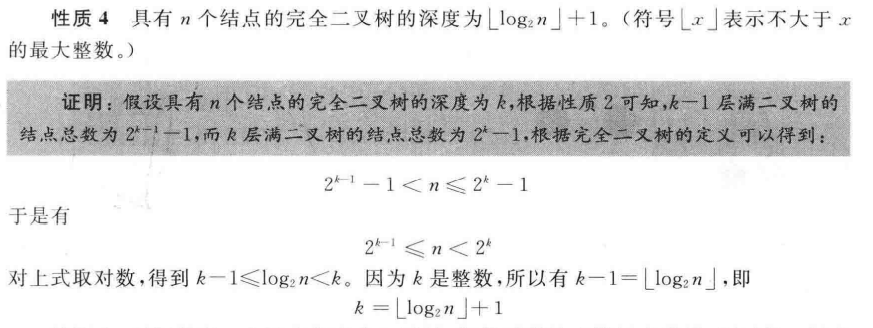

#### 性质5

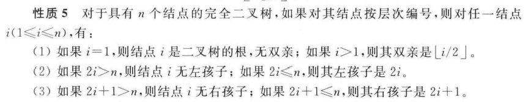

### 6.2.3 二叉树的存储结构

#### 1.顺序存储结构

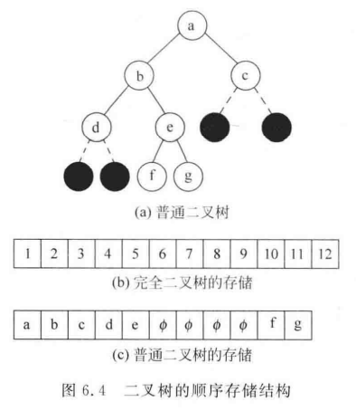

#### 2.链式存储结构

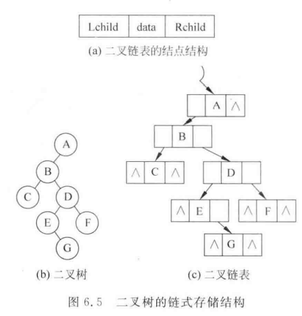

## 6.3二叉树的遍历与线索化

- **3．二叉树的遍历算法**
  - （1）深度递归和广度递归算法
  - （2）遍历算法的应用

基本要求：掌握理解二叉树深度遍历（前序，中序和后序）的递归和非递归算法，能够用二叉树遍历思想解决一些树的问题。

## 6.4树和森林

## 6.5哈夫曼树及其应用

## 6.6树的计数