<<<<<<< HEAD
# 树和二叉树

## \[学习目标\]

- **1．树的概念**
  - （1）树的概念
  - （2）树的存储结构


基本要求：掌握和理解有关树的概念，掌握和理解树的常用存储结构。

- **2．二叉树**
  - （1）二叉树的概念和性质
  - （2）二叉树的存储结构和基本算法实现。


基本要求：掌握和理解二叉树的概念和基本性质，掌握和理解二叉树的存储结构（特别是链式存储结构），能够实现二叉树的基本算法。

- **3．二叉树的遍历算法**
  - （1）深度递归和广度递归算法
  - （2）遍历算法的应用

基本要求：掌握理解二叉树深度遍历（前序，中序和后序）的递归和非递归算法，能够用二叉树遍历思想解决一些树的问题。

- **4．线索二叉树**

基本要求：掌握和理解线索二叉树的概念。

- **5．哈夫曼树**
  - （1）哈夫曼树的概念
  - （2）哈夫曼编码问题。

基本要求：掌握和理解哈夫曼树的概念，掌握和理解哈夫曼编码问题的实现。

- **6．树与二叉树的转换**
  - （1）树的遍历
  - （2）树和二叉树的转换

基本要求：掌握和理解树的遍历方法，能够进行树和二叉树的转换。

## 小结

- **1．树的概念**
  - （1）树的概念
  - （2）树的存储结构


基本要求：掌握和理解有关树的概念，掌握和理解树的常用存储结构。

## 6.1树的概念与基本操作

### 6.1.1 树的定义


**特点**

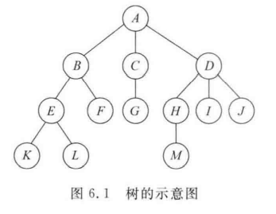

### 6.1.2 树的一些基本概念

- **结点**(node)
  表示树中的元素，包括数据项及若干指向其子树的分支
- **结点的度**(degree)
  结点拥有的子树的数目
  - **叶子**(leaf)**结点**
    度为0的结点称为叶子结点，也称为终端节点
  - **分支结点**
    度不为0的结点称为分支节点，也称为非终端节点
- **孩子结点**(child)
  结点的子树的根称为该结点的孩子结点
- **双亲结点**(parents)
  孩子结点的上层结点称为该结点的双亲结点
- **兄弟节点**(sibling)
  具有同一双亲结点的孩子结点之间互称为兄弟节点
- **树的度**
  树中最大的结点的度即为树的度
- **结点的层次**(level)
  从根节点算起，根为第1层，它的孩子为第二层，以此类推。若某节点在第i层，则其孩子结点在i+1层。
- **树的高**度(depth)
  树中结点的最大层次树。
- **森林**(forest)
  m棵互不相交的树的集合。
- **有序树和无序树**
  若树中结点从左至右是有次序的（不能互换），则称该树为**有序树**，否则称该树为**无序树**。

### 6.1.3 树的基本操作

- （1）$Init Tree(T)$初始化操作，置$T$为空树
- （2）$Root(T)$求$T$的树根。若$T$是空树，则函数返回值为$False$
- （3）$Create_Tree(T)$创建一棵树
- （4）$Parent(T,x)$求结点$x$的双亲结点。若结点$x$是树$T$的根结点，则函数返回值为$NULL$
- （5）$Child(T,x,i)$求树$T$中结点$x$的第$i$个孩子结点。若结点$x$是树$T$的叶子结点或无第$i$个孩子，则函数返回值为$False$
- （6）$InsertChild(Y,i,X)$插入子树。使以结点$X$为根的树为结点$Y$的第$i$棵子树。若原树中无结点$Y$或结点$Y$的子树的个数$<i-1$，则函数返回值为$False$
- （7）$DeleteChild(x,i)$删除子树。删除结点$x$的第$i$棵子树。若无结点$x$或结点$x$的子树个数$<i$，则函数返回值为$False$
- （8）$TraverseTree(T)$树的遍历。按某种次序依次访问树中的每个结点，并使每个结点仅被访问一次
- （9）$Clear(T)$清除树结构。将树$T$置为空树
- （10）$EmptyTree(T)$判断树$T$是否为空。若为空则返回$True$，否则返回$False$

## 6.2二叉树

- **2．二叉树**
  - （1）二叉树的概念和性质
  - （2）二叉树的存储结构和基本算法实现。


基本要求：掌握和理解二叉树的概念和基本性质，掌握和理解二叉树的存储结构（特别是链式存储结构），能够实现二叉树的基本算法。

- 

### 6.2.1 二叉树的定义和基本操作


#### 二叉树的特点  

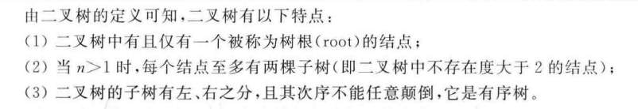

#### 二叉树的基本操作

- （1）$InitBtree(BT)$初始化操作，置$BT$为空二叉树
- （2）$Root(BT)$求$BT$的树根。若$BT$是空树，则返回$False$
- （3）$Create_BTree(BT)$创建一棵二叉树
- （4）$Parent(BT,x)$求结点$x$的双亲结点。若结点$x$是二叉树$BT$的根节点，则返回$False$
- （5）$Lchild(BT,x)$求二叉树$BT$中结点x的左孩子结点。若结点$x$是二叉树BT的叶子节点，则返回$False$
- （6）$Rchild(BT,x)$求二叉树$BT$中结点$x$的右孩子结点。若结点x是二叉树$BT$的叶子节点，则返回$False$
- （7）$TraverseBtree(BT)$二叉树的遍历。按某种次序依次访问二叉树中的每个结点，并使每个结点仅被访问一次
- （8）$Clear(BT)$清除二叉树结构。将树$BT$置为空树
- （9）$EmptyTree(BT)$判断二叉树$BT$是否为空。若为空则返回$True$，否则返回$False$

### 6.2.2 二叉树的性质

#### 性质1


#### 性质2


#### 性质3


#### 扩展 

##### 满二叉树


##### 完全二叉树


#### 性质4


#### 性质5


### 6.2.3 二叉树的存储结构

#### 1.顺序存储结构


#### 2.链式存储结构


## 6.3二叉树的遍历与线索化

- **3．二叉树的遍历算法**
  - （1）深度递归和广度递归算法
  - （2）遍历算法的应用

基本要求：掌握理解二叉树深度遍历（前序，中序和后序）的递归和非递归算法，能够用二叉树遍历思想解决一些树的问题。

- **4．线索二叉树**

基本要求：掌握和理解线索二叉树的概念。

### 6.3.1二叉树的遍历

#### 二叉树遍历的概念

所谓二叉树的遍历，是指按某条搜索路径访问树中的每一个结点，使得每一个系欸但均被访问一次，而且仅被访问一次。

#### 二叉树遍历的基本思想

二叉树的基本结构

- （访问）根结点（$D$）
- （遍历）左子树（$L$）
- （遍历）右子树（$R$）

因此存在：6种遍历二叉树的方式

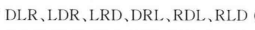

在此基础上规定按**先左后右**的顺序

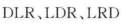

<hr />

- $DLR$ - 先根遍历（先序遍历）
- $LDR$ - 中根遍历（中序遍历）
- $LRD$ - 后根遍历（后序遍历）

#### 二叉树遍历的递归算法

```C
typedef struct Node
{
    datatype data;
    struct Node *Lchild;
    struct Node *Rchild;
}BTnode, *Btree;
```

##### 先根遍历

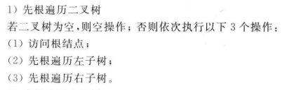

```C
void RreOrder(Btree root)
{
    if(root!=NULL)
    {
        visit(root->data);
        PreOrder(root->Lchild);
        PreOrder(root->Rchild);
    }
}
```

##### 中根遍历

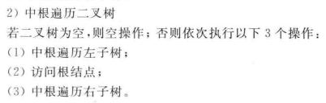
```C
void InOrder(Btree root)
{
    if(root！=NULL)
    {
        InOrder(root->Lchild);
        visit(root->data);
        InOrder(root->Rchild);  
    }
}
```

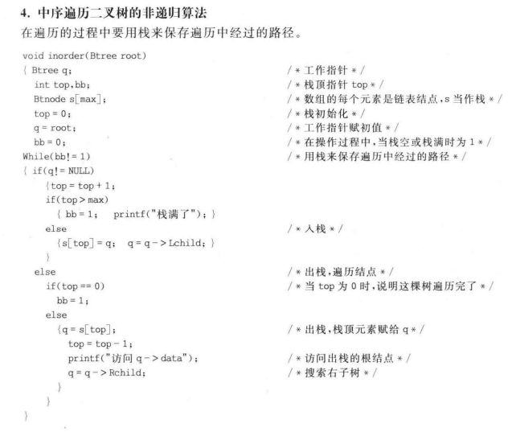


##### 后根遍历


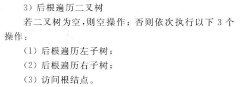
```c
  void PostOrder(Btree root)
{
    if(root！=NULL)
    {
        PostOrder(root->Lchild);
        PostOrder(root->Rchild);
        visit(root->data);
    }
}
```


##### 举例

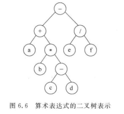
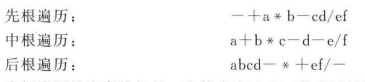

### 6.3.2线索二叉树

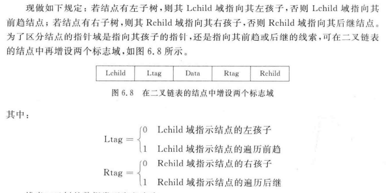

- 线索：附加的指针
- 线索链表：加上了线索的二叉链表
- 线索二叉树：由线索链表构成的二叉树

#### 线索二叉树的数据类型定义

```C
typedef struct Node
{
    datatype data;
    struct Node *Lchild;
    struct Node *Rchild;
  	int Ltag,Rtag;
}ThreadTnode,*ThreadTtree;
```

#### 中根遍历线索化算法
```C
void Inthread(ThreadTtree root)
{
    if(root!=NULL)
    {
        Inthread(root->Lchild);
        if(root->Lchild==NULL)
        {
            root->Ltag=1;root->Lchild=pre;//pre起初为NULL为赋值
        }
        if(pre!=NULL&&pre->Rchild==NULL)
        {
            pre->Rchild=root;
            pre->Rtag=1;
        }
        pre=root;
        Inthread(root->Rchild);
    }
}
```

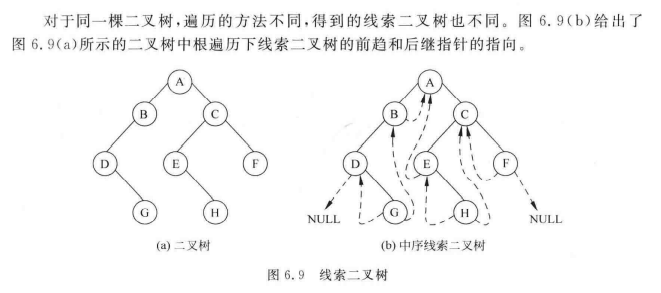

### 6.3.3基于遍历的应用与线索二叉树的应用

#### 1.输出二叉树中的节点

#### 2.输出二叉树中的叶子节点

#### 3.统计叶子结点的数目

#### 4.建立二叉树

#### 5.求二叉树的高度

#### 6.在中根遍历的线索树中查找前趋结点

#### 7.在中根遍历的线索树中查找后继节点

#### 8.鉴里一棵中序线索树的非递归算法

#### 9.在中序线索树中插入结点作为双亲结点右孩子（右子树）的算法

## 6.4树和森林

- **6．树与二叉树的转换**
  - （1）树的遍历
  - （2）树和二叉树的转换

基本要求：掌握和理解树的遍历方法，能够进行树和二叉树的转换。

### 6.4.1 树的存储结构

#### 1.双亲（数组）表示法

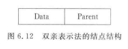  

$Data$：结点数据

$Parent$：父结点位置

<hr />

**举例**  

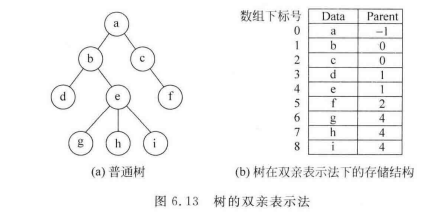  

**优缺点**  

- 查找某个结点的双亲结点非常容易
- 求某个节点的孩子结点困难

**数据类型定义**  

```c
#define Maxsize 50
typedef struct Node
{
	DataType data;
	int parent;
}Tnode;
Tnode Ptree[Maxsize];//Parent_tree
```


#### 2.孩子链表表示法

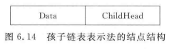  

$Data$：结点数据  

$ChildHead$：孩子结点的头指针

<hr />

**举例**  

  

**优缺点**  

- 很容易求得一个结点的孩子结点
- 求某结点的双亲结点很困难

**数据类型定义**  

```C
#define Maxsize 50
typedef struct ChildNode
{
	int Child;	//存储数据在数组中存储的位置下标
    struct ChildNode *next;
}
typedef struct
{
    DataType data;
    ChildNode *ChildHead;//孩子链表的头结点
}DataNode;
DataNode Ctree[Maxsize];//Child_tree
```


#### 3.孩子兄弟链表表示法

又称二叉链表表示法  

  

$FirstChild$：第一个孩子节点  

$Data$：结点数据  

$Nextsibling$：下一个兄弟结点  

<hr />

**举例**  

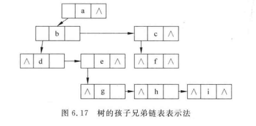

**优缺点**  

- 便于实现树的各种操作
- 如果在结构中为每个结点增设一个$parent$域，则可以方便查找双亲结点

**数据类型定义**  

```C
typedef struct CSNode
{
    DataType data;
    Struct CSNode *FirstCHild, *Nextsibling;
}*CSTree;//Child_Sibling_Tree
```


### 6.4.2 树、森林和二叉树之间的转换

#### 1.树转换为二叉树

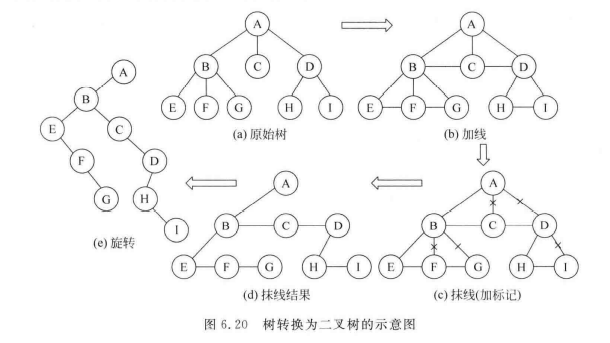  

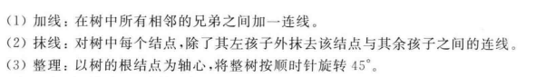

#### 2.森林转换为二叉树

#### 3.二叉树转换成树

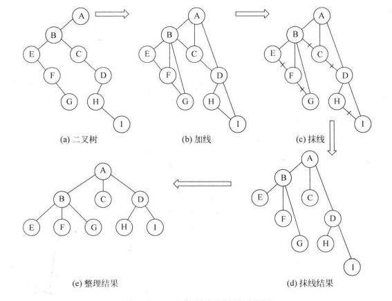  

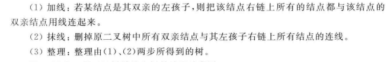

#### 4.二叉树转换成森林


### 6.4.3树和森林的遍历

#### 1.树的遍历

##### 先根遍历

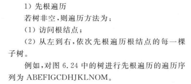

##### 后根遍历

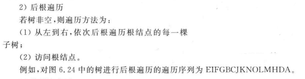

##### 按层次遍历

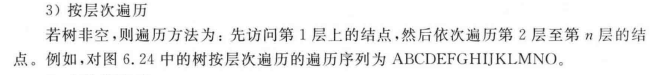

#### 2.森林的遍历


## 6.5哈夫曼树及其应用

**5．哈夫曼树**

- （1）哈夫曼树的概念
- （2）哈夫曼编码问题。

### 6.5.1与哈夫曼树相关的基本概念

### 6.5.2哈夫曼树的应用

##### 1.最佳判定树

##### 2.哈夫曼编码

### 6.5.3哈夫曼编码算法的实现

=======
# 树和二叉树

## \[学习目标\]

- **1．树的概念**
  - （1）树的概念
  - （2）树的存储结构


基本要求：掌握和理解有关树的概念，掌握和理解树的常用存储结构。

- **2．二叉树**
  - （1）二叉树的概念和性质
  - （2）二叉树的存储结构和基本算法实现。


基本要求：掌握和理解二叉树的概念和基本性质，掌握和理解二叉树的存储结构（特别是链式存储结构），能够实现二叉树的基本算法。

- **3．二叉树的遍历算法**
  - （1）深度递归和广度递归算法
  - （2）遍历算法的应用

基本要求：掌握理解二叉树深度遍历（前序，中序和后序）的递归和非递归算法，能够用二叉树遍历思想解决一些树的问题。

- **4．线索二叉树**

基本要求：掌握和理解线索二叉树的概念。

- **5．哈夫曼树**
  - （1）哈夫曼树的概念
  - （2）哈夫曼编码问题。

基本要求：掌握和理解哈夫曼树的概念，掌握和理解哈夫曼编码问题的实现。

- **6．树与二叉树的转换**
  - （1）树的遍历
  - （2）树和二叉树的转换

基本要求：掌握和理解树的遍历方法，能够进行树和二叉树的转换。

## 小结

- **1．树的概念**
  - （1）树的概念
  - （2）树的存储结构


基本要求：掌握和理解有关树的概念，掌握和理解树的常用存储结构。

## 6.1树的概念与基本操作

### 6.1.1 树的定义


**特点**


### 6.1.2 树的一些基本概念

- **结点**(node)
  表示树中的元素，包括数据项及若干指向其子树的分支
- **结点的度**(degree)
  结点拥有的子树的数目
  - **叶子**(leaf)**结点**
    度为0的结点称为叶子结点，也称为终端节点
  - **分支结点**
    度不为0的结点称为分支节点，也称为非终端节点
- **孩子结点**(child)
  结点的子树的根称为该结点的孩子结点
- **双亲结点**(parents)
  孩子结点的上层结点称为该结点的双亲结点
- **兄弟节点**(sibling)
  具有同一双亲结点的孩子结点之间互称为兄弟节点
- **树的度**
  树中最大的结点的度即为树的度
- **结点的层次**(level)
  从根节点算起，根为第1层，它的孩子为第二层，以此类推。若某节点在第i层，则其孩子结点在i+1层。
- **树的高**度(depth)
  树中结点的最大层次树。
- **森林**(forest)
  m棵互不相交的树的集合。
- **有序树和无序树**
  若树中结点从左至右是有次序的（不能互换），则称该树为**有序树**，否则称该树为**无序树**。

### 6.1.3 树的基本操作

- （1）$Init Tree(T)$初始化操作，置$T$为空树
- （2）$Root(T)$求$T$的树根。若$T$是空树，则函数返回值为$False$
- （3）$Create_Tree(T)$创建一棵树
- （4）$Parent(T,x)$求结点$x$的双亲结点。若结点$x$是树$T$的根结点，则函数返回值为$NULL$
- （5）$Child(T,x,i)$求树$T$中结点$x$的第$i$个孩子结点。若结点$x$是树$T$的叶子结点或无第$i$个孩子，则函数返回值为$False$
- （6）$InsertChild(Y,i,X)$插入子树。使以结点$X$为根的树为结点$Y$的第$i$棵子树。若原树中无结点$Y$或结点$Y$的子树的个数$<i-1$，则函数返回值为$False$
- （7）$DeleteChild(x,i)$删除子树。删除结点$x$的第$i$棵子树。若无结点$x$或结点$x$的子树个数$<i$，则函数返回值为$False$
- （8）$TraverseTree(T)$树的遍历。按某种次序依次访问树中的每个结点，并使每个结点仅被访问一次
- （9）$Clear(T)$清除树结构。将树$T$置为空树
- （10）$EmptyTree(T)$判断树$T$是否为空。若为空则返回$True$，否则返回$False$

## 6.2二叉树

- **2．二叉树**
  - （1）二叉树的概念和性质
  - （2）二叉树的存储结构和基本算法实现。


基本要求：掌握和理解二叉树的概念和基本性质，掌握和理解二叉树的存储结构（特别是链式存储结构），能够实现二叉树的基本算法。

- 

### 6.2.1 二叉树的定义和基本操作


#### 二叉树的特点  


#### 二叉树的基本操作

- （1）$InitBtree(BT)$初始化操作，置$BT$为空二叉树
- （2）$Root(BT)$求$BT$的树根。若$BT$是空树，则返回$False$
- （3）$Create_BTree(BT)$创建一棵二叉树
- （4）$Parent(BT,x)$求结点$x$的双亲结点。若结点$x$是二叉树$BT$的根节点，则返回$False$
- （5）$Lchild(BT,x)$求二叉树$BT$中结点x的左孩子结点。若结点$x$是二叉树BT的叶子节点，则返回$False$
- （6）$Rchild(BT,x)$求二叉树$BT$中结点$x$的右孩子结点。若结点x是二叉树$BT$的叶子节点，则返回$False$
- （7）$TraverseBtree(BT)$二叉树的遍历。按某种次序依次访问二叉树中的每个结点，并使每个结点仅被访问一次
- （8）$Clear(BT)$清除二叉树结构。将树$BT$置为空树
- （9）$EmptyTree(BT)$判断二叉树$BT$是否为空。若为空则返回$True$，否则返回$False$

### 6.2.2 二叉树的性质

#### 性质1


#### 性质2


#### 性质3


#### 扩展 

##### 满二叉树


##### 完全二叉树


#### 性质4


#### 性质5


### 6.2.3 二叉树的存储结构

#### 1.顺序存储结构


#### 2.链式存储结构


## 6.3二叉树的遍历与线索化

- **3．二叉树的遍历算法**
  - （1）深度递归和广度递归算法
  - （2）遍历算法的应用

基本要求：掌握理解二叉树深度遍历（前序，中序和后序）的递归和非递归算法，能够用二叉树遍历思想解决一些树的问题。

- **4．线索二叉树**

基本要求：掌握和理解线索二叉树的概念。

### 6.3.1二叉树的遍历

#### 二叉树遍历的概念

所谓二叉树的遍历，是指按某条搜索路径访问树中的每一个结点，使得每一个系欸但均被访问一次，而且仅被访问一次。

#### 二叉树遍历的基本思想

二叉树的基本结构

- （访问）根结点（$D$）
- （遍历）左子树（$L$）
- （遍历）右子树（$R$）

因此存在：6种遍历二叉树的方式


在此基础上规定按**先左后右**的顺序


<hr />

- $DLR$ - 先根遍历（先序遍历）
- $LDR$ - 中根遍历（中序遍历）
- $LRD$ - 后根遍历（后序遍历）

#### 二叉树遍历的递归算法

```C
typedef struct Node
{
    datatype data;
    struct Node *Lchild;
    struct Node *Rchild;
}BTnode, *Btree;
```

##### 先根遍历


```C
void RreOrder(Btree root)
{
    if(root!=NULL)
    {
        visit(root->data);
        PreOrder(root->Lchild);
        PreOrder(root->Rchild);
    }
}
```

##### 中根遍历


```C
void InOrder(Btree root)
{
    if(root！=NULL)
    {
        InOrder(root->Lchild);
        visit(root->data);
        InOrder(root->Rchild);  
    }
}
```


##### 后根遍历


```c
  void PostOrder(Btree root)
{
    if(root！=NULL)
    {
        PostOrder(root->Lchild);
        PostOrder(root->Rchild);
        visit(root->data);
    }
}
```


##### 举例


### 6.3.2线索二叉树


- 线索：附加的指针
- 线索链表：加上了线索的二叉链表
- 线索二叉树：由线索链表构成的二叉树

#### 线索二叉树的数据类型定义

```C
typedef struct Node
{
    datatype data;
    struct Node *Lchild;
    struct Node *Rchild;
  	int Ltag,Rtag;
}ThreadTnode,*ThreadTtree;
```

#### 中根遍历线索化算法
```C
void Inthread(ThreadTtree root)
{
    if(root!=NULL)
    {
        Inthread(root->Lchild);
        if(root->Lchild==NULL)
        {
            root->Ltag=1;root->Lchild=pre;//pre起初为NULL为赋值
        }
        if(pre!=NULL&&pre->Rchild==NULL)
        {
            pre->Rchild=root;
            pre->Rtag=1;
        }
        pre=root;
        Inthread(root->Rchild);
    }
}
```


### 6.3.3基于遍历的应用与线索二叉树的应用

#### 1.输出二叉树中的节点

#### 2.输出二叉树中的叶子节点

#### 3.统计叶子结点的数目

#### 4.建立二叉树

#### 5.求二叉树的高度

#### 6.在中根遍历的线索树中查找前趋结点

#### 7.在中根遍历的线索树中查找后继节点

#### 8.鉴里一棵中序线索树的非递归算法

#### 9.在中序线索树中插入结点作为双亲结点右孩子（右子树）的算法

## 6.4树和森林

- **6．树与二叉树的转换**
  - （1）树的遍历
  - （2）树和二叉树的转换

基本要求：掌握和理解树的遍历方法，能够进行树和二叉树的转换。

### 6.4.1 树的存储结构

#### 1.双亲（数组）表示法

  

$Data$：结点数据

$Parent$：父结点位置

<hr />

**举例**  

  

**优缺点**  

- 查找某个结点的双亲结点非常容易
- 求某个节点的孩子结点困难

**数据类型定义**  

```c
#define Maxsize 50
typedef struct Node
{
	DataType data;
	int parent;
}Tnode;
Tnode Ptree[Maxsize];//Parent_tree
```


#### 2.孩子链表表示法

  

$Data$：结点数据  

$ChildHead$：孩子结点的头指针

<hr />

**举例**  

  

**优缺点**  

- 很容易求得一个结点的孩子结点
- 求某结点的双亲结点很困难

**数据类型定义**  

```C
#define Maxsize 50
typedef struct ChildNode
{
	int Child;	//存储数据在数组中存储的位置下标
    struct ChildNode *next;
}
typedef struct
{
    DataType data;
    ChildNode *ChildHead;//孩子链表的头结点
}DataNode;
DataNode Ctree[Maxsize];//Child_tree
```


#### 3.孩子兄弟链表表示法

又称二叉链表表示法  

  

$FirstChild$：第一个孩子节点  

$Data$：结点数据  

$Nextsibling$：下一个兄弟结点  

<hr />

**举例**  


**优缺点**  

- 便于实现树的各种操作
- 如果在结构中为每个结点增设一个$parent$域，则可以方便查找双亲结点

**数据类型定义**  

```C
typedef struct CSNode
{
    DataType data;
    Struct CSNode *FirstCHild, *Nextsibling;
}*CSTree;//Child_Sibling_Tree
```


### 6.4.2 树、森林和二叉树之间的转换

#### 1.树转换为二叉树

  


#### 2.森林转换为二叉树

#### 3.二叉树转换成树

  


#### 4.二叉树转换成森林


### 6.4.3树和森林的遍历

#### 1.树的遍历

##### 先根遍历


##### 后根遍历


##### 按层次遍历


#### 2.森林的遍历


## 6.5哈夫曼树及其应用

**5．哈夫曼树**

- （1）哈夫曼树的概念
- （2）哈夫曼编码问题。

### 6.5.1与哈夫曼树相关的基本概念

### 6.5.2哈夫曼树的应用

##### 1.最佳判定树

##### 2.哈夫曼编码

### 6.5.3哈夫曼编码算法的实现

>>>>>>> e71128735cbd1c6b07dc2aaa04ec2da55b4a32f0
## 6.6树的计数